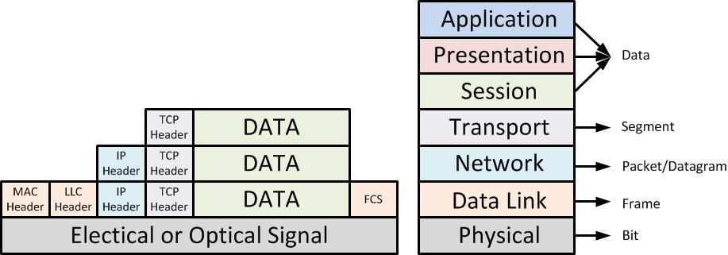
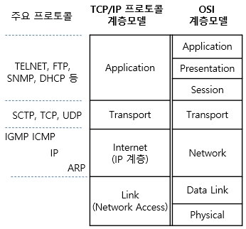
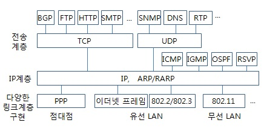
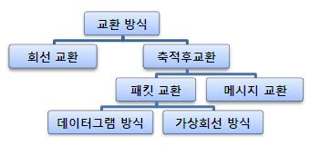

# 2. Network

## 2.1 네트워크의 기초


### :star: 패킷(Packet)

네트워크 상 데이터를 송수신하는 __논리적인__ 단위.
- 헤더, 데이터, 트레일러로 구성됨.

패킷을 캡슐화(특정제어정보, 주로 Header를 추가하는 것)를 하면, 물리적인 데이터 단위 프레임으로 볼 수 있다.




```markdown
- 프로토콜 계층 별로 주로 사용되는 데이터 단위의 명칭
  ㅇ  7  응용 계층      : 메세지, 데이터 
  ㅇ  6  표현 계층      : 메세지, 데이터 
  ㅇ  5  세션 계층      : 메세지, 데이터
  ㅇ  4  전송 계층      : 세그먼트
  ㅇ  3  네트워크 계층  : 패킷, 데이터그램
  ㅇ  2  데이터링크 계층 : 프레임
  ㅇ  1  물리 계층      : 비트
```


- 처리량(throughput)
    단위 시간당 시스템에서 처리할 수 있는 데이터 양. 

- 지연 시간(latency)
    패킷망 상에서, 송신지부터 목적지 호스트까지, 패킷이 왕복하는데 걸리는 시간.

- 대역폭(bandwidth)
    단위 시간당 전송할 수 있는 데이터 양.

  대역폭은 데이터 전송 속도를 결정하는 요소이다. 시스템의 성능은 대역폭 이외의 다른 요소에도 영향을 받는다. 프로세서의 속도, 메모리 대역폭, 디스크 속도, 애플리케이션의 병목현상 등...


- 네트워크 토폴로지(topology)
  Tree, Bus, Star, Ring, Mesh,


- 스푸핑(Spoofing)
    IP 스푸핑: IP 패킷 내의 발신 IP 주소를 도용, 허가된 사용자인 것 처럼 위장.
    MAC 스푸핑: 이더넷 프레임의 발신 MAC 주소를 가공의 MAC 주소로 속여 발송. 
    (MAC 주소 테이블 버퍼를 초과시키는게 대표적)

- 병목현상(bottleneck)
  네트워크 토폴로지, 즉 구조에 따라 특정 구성요소가 마비될 경우 병목현상이 유발될 수 있다.
  

- 네트워크 분류
  LAN(Local), MAN(Metropolitan), WAN(Wide)

- 프로토콜(protocol)
  다른 장치들끼리 데이터를 주고받기 위해 설정된 공통된 인터페이스.
  규칙보다는 표준으로 해석하는게 더 편하다.


## 2.2 TCP/IP 4계층 모델


### :star: Transmission Control Protocol/Internet Protocol

TCP/IP : TCP, IP 라고 불리는 프로토콜을 중심으로 구성되는 일련의 프로토콜들의 총칭. 100개가 넘는다.
application, transport, Internet, Link으로 4가지 계층을 가짐.





- application
  응용 프로그램이 사용되는 프로토콜 계층

- transport
  송신자와 수신자를 연결하는 통신 서비스 제공. 연결 지향 데이터 스트리 지원, 신뢰성, 흐름 제어. 애플리케이션과 인터넷 계층 사이의 데이터가 전달될 때 중계.



가상 회선 - 연결지향
데이터그램 - 비연결


- 3-way Handshaking 
  1. 세그먼트 1(SYN)        :   연결 요청(초기 동기화 패킷)
  2. 세그먼트 2(SYN + ACK)  :   연결 허락
  3. 세그먼트 3(ACK)        :   연결 설정

-> 신뢰적인 연결지향성(오류가 없는 세션유지...)

- 4-way Handshaking
  1. FIN 세그먼트           : 클라이언트측의 연결 종료 요청
  2. ACK 세그먼트           : 연결 종료 요청에 대한 서버측의 응답
  3. FIN + ACK 세그먼트     : 서버측의 종료 알림
  4. ACK 세그먼트           : 클라이언트측의 최종 종료 알림

  ㅇ TIME-WAIT
     - 최대 세그먼트 수명(MSL,Maximum Segment Lifetime)의 2배를 기다림
     - 지정된 시간이 지나면, Closed 상태로 전이됨


- Internet
  네트워크의 IP 주소를 정의하고, IP 패킷의 전달 및 라우팅을 담당.

  - 이중화 Duplexing 
    - 단일 매체, 장치, 포트에서 동시 양방향 통신을 가능케 함.
    - 안정성을 높이기 위해 동일 장치/구간 등을 2 이상 준비해두는 이중화

  전이중 : 동시에 양방향 전송
  반이중 : 한번에 한방향 전송


## 2.3 네트워크 기기

### 네트워크 기기의 처리 범위
계층 별로 처리 범위를 나눌 수 있다.
물리 계층, 데이터 링크 계층 등..

상위 계층을 처리하는 기기는 하위 계층을 처리할 수 있다. 역은 불가.

애플리케이션 계층: L7 스위치
인터넷 계층 : 라우터, L3 스위치
데이터 링크 계층 : L2 스위치, 브리지
물리 계층 : NIC, 리피터, AP

### 애플리케이션 계층을 처리하는 기기

스위치는 여러 장비를 연결하고 데이터 통신을 중재하며 목적지가 연결된 포트로만 전기 신호를 보내 데이터를 전솔하는 통신 네트워크 장비다.

- L7 스위치 : 로드 밸런서, 서버의 부하를 분산하는 기기
- 클라이언트로 오는 요청들을 여러 서버로 나눈다.
- 시스템이 처리할 수 있는 트래픽 증가를 목표로함.
- URL, 서버, 캐시, 쿠키들을 기반으로 트래픽 분산.
- 바이러스. 불필요 외부 데이터 필터링. 트래픽 모니터링
- 정기적인 헬스체크


로드 벨런서는 L4 스위치도 있다. L4 스위치는 인터넷 계층을 처리하는 기기

스트리밍 서비스에서는 사용 불가. 메시지 기반x IP와 포트 기반 트래픽 분산.
하지만 L7로드 벨런서는 IP, 포트 외에도 URL, HTTP 헤더, 쿠키 등을 기반으로 트래픽 분산이 가능하다!

ALB(Application Load Balancer) 컴포넌트로 로드밸런싱, 
L4는 NLB(Network Load Balancer)

- 헬스 체크
  정상/비정상 서버를 판별한다. 전송 주기, 재전송 횟수 등을 설정한 이후 반복적으로 서버에 요청을 보냄.

  여기서 TCP 요청을 보냈는데 3-way handshake가 잘 일어나지 않으면 비정상인 거다..

로드밸런서를 이용한 서버 이중화

- 서버를 안정적으로 운용하기 위해서는 2대 이상의 서버는 필수적이다. 에러로 서버 1대가 종료되더라도 서비스는 안정적으로 운용되어야 하기 때문. 

로드밸런서가 가상 ip에 접근하고 뒤에 사용가능한 정상 서버로 보낸다..


### 인터넷 계층을 처리하는 기기

라우터, L3 스위치가 있다.

- 라우터
  여러 개의 네트워크를 연결, 분할, 구분시켜주는 역할을 하며 "다른 네트워크에 존재하는 장치끼리 서로 데이터를 주고받을 때 패킷 소모를 최소화하고 경로를 최적화 하여 최소 경로로 패킷을 포워딩" 
  하는 라우팅을 하는 장비

- L3 스위치
  L2 스위치 기능과 라우팅 기능을 갖충 장비를 말함. L3 스위치를 라우터라 해도 무방하다. 라우터는 소프트웨어 기반의 라우팅과 하드웨어 기반의 라우팅을 하는 것으로 나눠지고 하으퉤어 기반의 라우팅을 담당하는 장치를 L3스위치라고한다.

### 데이터 링크 계층을 처리하는 기기

L2 스위치와 브리지가 있다.

- L2 스위치는 장치들의 맥 주소를 맥 주소 테이블을 통해 관리. 연결된 장치로 패킷이 왓을 때 패킷 전송을 담당.

ip 주소를 이해하지 못함.
단순히 패킷의 맥 주소를 읽어 스위칭하는 역할을 함.


- 브리지
  두 개의 근거리 통신망을 상호 접속할 수 있도록 하는 통신망 연결 장치.
  하나의 통신망을 구축할 때 쓰인다.


### 물리 계층을 처리하는 기기

NIC, 리피터, AP가 있다.

- NIC
  랜 카드라고 하는 네트워크 인터페이스 카드(Network Interface Card)는 2개 이상의 컴퓨터 네트워크를 구성하는 데 사용하며, 네트워크와 빠른 속도로 데이터를 송수신 할 수 있도록 컴퓨터 내에 설치하는 확장 카드.

  각 LAN 카드에는 주민등록번호처럼 각각을 구분하기 ㅜ이한 고유의 식별번호인 맥 주소가 있다.

- 리피터
  리피터는 들어오는 약해진 신호 정도를 증폭하여 다른 쪽으로 전달하는 장치를 말한다. 구시대의 잔재

- AP
  Access Point는 패킷을 복사하는 기기.
  AP에 유선 LAN을 연결한 수 다른 장치에서 무선 LAN 기술을 사용하여 무선 네트워크르 연결을 할 수 있다.


## 2.4 IP 주소

### ARP
 
컴퓨터와 컴퓨터 간의 통신은 흔히들 ip 주소 기반으로 통신한다고 알고 있지만 정확히는 IP 주소에서 ARP를 통해 MAC 주소를 찾아 MAC 주소를 기반으로 통신한다.

- ARP(Address Resolution Protocol)
  IP 주소로부터 MAC 주소를 구하는 IP와 MAC 주소의 다리 역할을 하는 프로토콜

가상 IP 주소 -> MAC 주소
물리 MAC 주소 -> IP 주소 (RARP)

ARP Request 브로트캐스트, IP 주소에 해당하는 MAC 주소 찾고, 해당 주소의 장치가 
ARP reply 유니 캐스트를 통해 MAC 주소를 반환


### 홉바이홉 통신

IP 주소를 통해 통신하는 과정을 hop by hop 통신이라고함.

홉은 건너뛰는 것. 통신망에서 각 패킷이 여러 개의 라우터를 건너가는 모습을 비유적으로 표현한 것.
각각의 라우터에 있는 라우팅 테이블의 IP를 기반으로 패킷을 전달하고 다시 전달함.

통신 장치에 있는 라우팅 테이블의 IP를 통해 시작 주소부터 시작하여 다음 IP로 계속 이동.
라우팅을 통해 패킷이 최종 목적지까지 도달하는 통신.

- 라우팅 테이블
  라우팅 테이블은 송신지에서 수신지까지 도달하기 위해 사용됨.
  라우터에 들어가 있는 목적지 정보들과 그 목적지로 가기위한 방법이 들어 있는 리스트.
  게이트웨이와 모든 목적지에 대해 해당 목적지에 도달하기 위해 거쳐야할 다음 라우터의 정보를 가지고 있다.

- 게이트 웨이
  게이트 웨이는 서로 다른 통신망, 프로토콜을 사용하는 네트워크 간의 통신을 가능하게 하는 컴퓨터 및 소프트웨어를 일컫는 용어.

  통신 프로토콜을 변환해준다.

### IP 주소 체계

IPv4와 IPv6로 나뉨. 
IPv4 - 32비트를 8비트 단위로 점을 찍어 표기.  255.255.255.255
IPv6 - 64비트를 16비트 단위로 점을 찍어 표기. fe80::5511:39dc:cd50:369c

- 클래스 기반 할당 방식.
  ip주소 체계는 과거를 거쳐 발전해오고 있으며 처음에는 A,B,C,D,E 5개의 클래스 기반 할당 방식(CIDP)을 사용.
  
  클래스 A, B, C는 일대일 통신으로 사용되고 클래스 D는 멀티캐스트 통신, 클래스 E는 앞으로 사용할 예비용.
  A의 경우 0.0.0.0 부터 127.255.255.255까지 범위를 가짐.

  A : 0.0.0.0     ~   127.255.255.255
  B : 127.0.0.0   ~   191.255.255.255
  C : 192.0.0.0   ~   223.255.255.255
  ...

구분 비트.. 첫 주소는 네트워크 주소, 마지막 주소는 브로드캐스트용 주소.

버리는 주소가 많다는 단점 -> DHCP, IPv6, NAT가 나온다.

- DHCP(Dynamic Host Configuration Protocol)은 IP 주소 및 기타 통신 매개변수를 자동으로 할당하기 위한 
  네트워크 관리 프로토콜. 이 기술을 통해 네트워크 장치의 ip주소를 수동으로 설정할 필요가 없다. 

  많은 라우터와 게이트웨이 장비에 DHCP 기능이 있다. 가정용 네트워크에서 IP 주소를 할당.

- NAT(Network Address Translation)은 패킷이 라우팅 장치를 통해 전송되는 동안 패킷의 IP주소 정보 수정.
  IP 주소를 다른 주소로 매핑.
  NAT으로 공인 IP와 사설 IP로 나눠서 많은 주소를 처리함. 
  NAT를 가능하게 하는 소프트웨어는 ICS, RRAS, Netfilter 등이 있다.

  어비스, 스위치, NAT 장치, 인터넷
  공유기와 NAT
    NAT을 쓰는 이유는 주로 여러 대의 호스트가 하나의 공인 IP 주소를 사용하여 인터넷에 접속하기 위함.
  NAT을 이용한 보안. - 드러나는 IP를 다르게 할 수 있어서.
  NAT의 단점 - 같은 인터넷을 공유해서 속도가 느려질 수 있다.


### IP 주소를 이용한 위치 정보
동 또는 구까지 위치 추적이 가능하다. 헉!!!!!!


## HTTP


