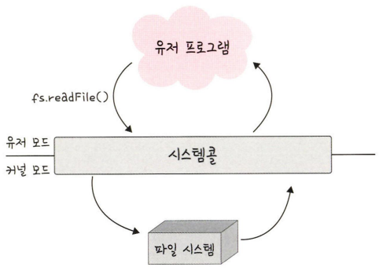

# 3장 운영체제

```markdown
목차
- 3.1 운영체제와 컴퓨터(134)
- 3.2 메모리(142)
- 3.3 프로세스와 스레드(157)
- 3.4 CPU 스케줄링 알고리즘(178)
```

# 3.1 운영체제와 컴퓨터

## 3.1.1 운영체제의 역할과 구조

### 운영체제의 역할

1. **CPU 스케줄링과 프로세스 관리** : CPU 소유권을 어떤 프로세스에 할당할 지, 프로세스의 생성과 삭제, 자원 할당 및 반환 관리
2. **메모리 관리** : 한정된 메모리를 어떤 프로세스에 얼만큼 할당해야 하는지 관리
3. **디스크 파일 관리** : 디스크 파일을 어떠한 방법으로 보관할지 관리
4. **I/O 디바이스 관리** : I/O 디바이스들인 마우스, 키보드와 컴퓨터 간에 데이터를 주고받는 것을 관리

### 운영체제 구조

유저 프로그램이 맨 위에 있고 그 다음으로 GUI, 시스템 콜, 커널, 드라이버가 있으며 가장 밑에 하드웨어가 있는 구조

GUI, 시스템콜, 커널, 드라이버 부분을 묶어 운영체제라고 지칭

[참고] GUI가 없고 CUI만 있는 리눅스 서버도 존재

```markdown
<용어>
- GUI : Graphic User Interface
- CUI : Character User Interface
```

**시스템 콜**

- 운영체제가 커널에 접근하기 위한 인터페이스, 유저 프로그램이 운영체제의 서비스를 받기 위해 커널 함수를 호출할 때 사용
- 유저 프로그램이 I/O 요청으로 트랩(trap)을 발동하면 올바른 I/O 요청인지 확인한 후 유저 모드가 시스템 콜을 통해 커널 모드로 변환되어 실행.
    
    
    
    - 이 때, 유저 모드에서 파일을 읽지 않고 커널 모드로 들어가 파일을 읽고 다시 유저 모드로 돌아가 그 뒤에 있는 유저 프로그램의 로직을 수행
        - 이를 통해 컴퓨터 자원에 대한 직접 접근을 차단할 수 있고 프로그램을 보호할 수 있음
    
    ```markdown
    I/O 요청
    - 입출력 함수, 데이터베이스, 네트워크, 파일 접근 등에 관한 일
    드라이버
    - 하드웨어를 제어하기 위한 소프트웨어
    ```
    

**시스템 콜과 커널, 운영체제**


- 프로세스나 스레드에서 운영체제로 어떠한 요청을 할 때 시스템 콜이라는 인터페이스와 커널을 거쳐 운영체제에 전달
- 이 시스템 콜은 하나의 추상화 계층. 따라서 네트워크 통신이나 데이터베이스와 같은 낮은 단계의 영역 처리에 대한 부분을 많이 신경쓰지 않고 프로그램을 구현할 수 있음

**modebit**

- 시스템콜이 작동될 때 modebit를 참고해서 유저모드와 커널 모드를 구분.
- 1 또는 0의 값을 가지는 플래그 변수
- I/O 디바이스는 운영체제를 통해서만 작동해야 함
    - 유저모드를 기반으로 카메라가 켜진다면 사용자가 의도하지도 않았는데 공격자가 카메라를 갑자기 켜는 등 나쁜짓하기 쉬움
    - 커널 모드를 거쳐 운영체제를 통해 작동한다고 해도 공격을 100% 막을 순 없지만 운영체제를 통해 작동하게 해야 막기가 쉬움 - modebit의 0은 커널모드, 1은 유저모드 라고 설정, 유저 모드일 경우 시스템콜을 못하게 막아서 한정된 일만 가능하게 함
    
    
    
    - 유저 프로그램이 카메라를 이용하려 할 때 시스템콜을 호출하고 modebit를 1에서 0으로 바꾸며 커널 모드로 변경한 후 카메라 자원을 이용한 로직 수행
    - 이후 modebit를 0에서 1로 바꿔 유저모드로 변경 후 로직 수행
    
    ```markdown
    유저 모드 : 유저가 접근할 수 있는 영역을 제한저긍로 두며 컴퓨터 자원에 함부로 침범하지 못하는 모드
    커널 모드 : 모든 컴퓨터 자원에 접근할 수 있는 모드
    커널 : 운영체제의 핵심 부분이자 시스템콜 인터페이스를 제공, 운영체제의 중추적인 역할 수행
    ```
    

## 3.1.2 컴퓨터의 요소


### CPU(Central Processing Unit)

산술 논리 연상 장치, 제어장치, 레지스터로 구성

메모리에 존재하는 명령어를 해석해서 실행하는 일꾼


**제어장치 CU : Control Unit**

- 프로세스 조작을 지시하는 CPU의 부품
- 입출력 장치 간 통신을 제어
- 명령어를 읽고 해석하여 데이터 처리를 위한 순서 결정

**레지스터 Register**

- CPU 안에 있는 매우 빠른 임시 기억 장치
- 개빠름
- CPU는 자체적으로 데이터를 저장할 방법이 없어서 레지스터를 거쳐 데이터를 전달함

**산술 논리 연산장치 ALU : Arithmetric Logic Unit**

- 산술 연산, 논리연산 계산

CPU의 연산 처리


**인터럽트**

- 어떤 신호가 왔을 때 CPU를 잠깐 정지 시키는 것
- 인터럽트 발생 시 인터럽트 핸들러 함수가 모여있는 인터럽트 벡터로 가서 인터럽트 핸들러 함수 실행
    - 인터럽트 간에는 우선순위가 있고 우선순위에 따라 실행
    
    ```markdown
    인터럽트 핸들러 함수
    - 인터럽트가 발생했을 때 이를 핸들링하기 위한 함수.
    - 커널 내부의 IRQ를 통해 호출, request_irq()를 통해 인터럽트 핸들러 함수 등록 가능
    ```
    
- 하드웨어 인터럽트
    - I/O 디바이스에서 발생하는 인터럽트
    - 인터럽트 라인이 설계된 이후 순차적인 인터럽트 실행을 중지하고 운영체제에 시스템콜을 요청해서 원하는 디바이스로 향해 디바이스에 있는 작은 로컬 버퍼에 접근하여 일을 수행
- 소프트웨어 인터럽트
    - 트랩(trap)이라고도 함
    - 프로세스 오류 등으로 프로세스가 시스템 콜을 호출할 때 발동

## DMA 컨트롤러

- I/O 디바이스가 메모리에 직접 접근할 수 있도록 하는 하드웨어 장치
- CPU에만 너무 많은 인터럽트 요청이 들어오기 때문에 CPU 부하를 막아줌 : CPU 보조 일꾼
- 하나의 작업을 CPU와 DMA 컨트롤러가 동시에 하는 것을 방지

### 메모리

- 전자회로에서 데이터나 상태, 명령어 등을 기록하는 장치
- 보통 RAM(Random Access Memory)을 말함
- CPU는 계산담당, 메모리는 기억 담당

### 타이머

- 몇초 안에는 작업이 끝나야 한다는 것을 정하고 특정 프로그램에 시간 제한을 다는 역할
- 시간이 많이 걸리는 프로그램이 작동할 때 제한을 걸기위해 존재

### 디바이스 컨트롤러

- 컴퓨터와 연결되어있는 IO 디바이스들의 작은 CPU를 의미

# 3.2 메모리

메모리 계층과 메모리 관리

## 3.2.1 메모리 계층

레지스터, 캐시, 메모리, 저장 장치로 구성

