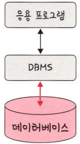

# 4장 데이터베이스

# 4.1 데이터베이스의 기본

데이터베이스는 일정한 규칙, 혹은 규약을 통해 구조화되어 저장되는 데이터의 모음

해당 데이터베이스를 제어, 관리하는 통합 시스템을 DBMS(DataBase Management System)

데이터베이스 안에 있는 데이터들은 특정 DBMS마다 정의된 쿼리 언어(Query Language)를 통해 CRUD 수행

데이터베이스는 실시간 접근과 동시 공유가 가능



Django - DBMS(SQLite) - 데이터베이스

## 4.1.1 엔터티(entity)

- 사람, 장소, 물건 등 여러 개의 속성을 지닌 명사를 의미
- 예) 회원 : 이름, 아이디, 주소, 전화번호의 속성을 가짐
- 예) 주소라는 속성이 서비스의 요구 사항과 무관한 속성이라면 주소라는 속성은 사라짐

### 약한 엔터티와 강한 엔터티

- 예) A가 혼자서는 존재하지 못하고 B의 존재 여부에 따라 종속적이다
    
    ⇒ A : 약한 엔터티, B : 강한 엔터티
    

## 4.1.2 릴레이션(relation)

- 정보를 구분하여 저장하는 기본 단위
- 엔터티에 관한 데이터를 데이터베이스는 릴레이션 하나에 담아서 관리
    
    
    
    - 회원이라는 엔터티가 데이터베이스에서 관리될 때 릴레이션으로 변화된 것을 확인
    - 릴레이션은 관계형 데이터베이스에서는 ‘테이블’이라 함
    - NoSQL에서는 ‘컬렉션’

### 테이블과 컬렉션

데이터베이스 종류 : 관계형 데이터베이스, NoSQL 데이터베이스로 구분

대표적인 관계형 데이터베이스 : MySQL

- 레코드 - 테이블 - 데이터베이스로 구성

대표적인 NoSQL 데이터베이스 : MongoDB

- 도큐먼트 - 컬렉션 - 데이터베이르로 구성


위 그림처럼 레코드가 쌓여 테이블이 되고, 테이블이 쌓여 데이터베이스가 됨

## 4.1.3 속성(attribute)

- 릴레이션에서 관리하는 구체적이며 고유한 이름을 갖는 정보
- 예) ‘차’ 라는 엔터티의 속성 : 차 번호, 바퀴 수, 차 색깔, 차종 등
    - 이 중 서비스의 요구사항을 기반으로 관리해야 할 필요가 있는 속성들만 엔터티의 속성이 됨

### 4.1.4 도메인(domain)

- 릴레이션에 포함된 각각의 속성들이 가질 수 있는 값의 집합
- 예) 성별이라는 속성이 있다면 이 속성이 가질 수 있는 값 : {남, 여}
    
    
    
    - 회원이라는 릴레이션에 이름, 아이디, 주소, 전화번호, 성별이라는 속성 존재
    - 성별은 {남, 여} 라는 도메인을 가짐

## 4.1.5 필드와 레코드

위 설명들을 기반으로 데이터베이스에서 필드와 레코드로 구성된 테이블을 만들 수 있음


- 회원이란 엔터티는 member라는 테이블로 속성인 이름, 아이디 등을 가지고 있으며, name, ID, address 등의 필드를 가짐. 그리고 이 테이블에 쌓이는 행(row) 단위의 데이터: `**레코드** 또는 **튜플**`
- 예) ‘책’이라는 엔터티를 정의하고 이를 기반으로 테이블을 만듬.
    - 속성 : 이름, 저자의 아이디, 출판 년도, 장르, 생성 일시, 업데이트 일시만 있다고 가정
    - 책의 아이디 : INT
    - 책의 제목 : VARCHAR(255)
    - 책의 저자 아이디 : INT
    - 책의 출판년도 : VARCHAR(255)
    - 책의 장르 : VARCHA(255)
    - 생성 일시 : DATETIME
    - 업데이트 일시 : DATETIME
    
    
    

### 필드 타입

필드는 타입을 가짐. 예를들어 이름 : 문자열, 전화번호 : 숫자

**숫자 타입**


**날짜 타입**

DATE, DATETIME, TIMESTAMP 등

- DATE
    - 날짜부분은 있지만 시간 부분은 없는 값
    - 1000-01-01 ~ 9999-12-31
- DATETIME
    - 날짜 및 시간 부분을 모두 포함하는 값
    - 1000-01-01 00:00:00 ~ 9999-12-31 23:59:59
- TIMESTAMP
    - 날짜 및 시간 부분을 모두 포함하는하는 값에 사용됨
    - 1970-01-01 00:00:01 ~ 2038-01-19 03:14:07

**문자 타입**

CHAR, VARCHAR, TEXT, BLOB, ENUM, SET

- CHAR, VARCHAR
    - 그 안에 수를 입력해서 몇자까지 입력할 지 정함
    - CHAR : 테이블을 생성할 때 선언한 길이로 **고정**
        - 0 ~ 255
    - VARCHAR : 가변 길이 문자열
        - 0 ~ 65535
- TEXT, BLOB
    - TEXT : 큰 문자열, 주로 게시판의 본문을 저장할 때 사용
    - BLOB : 이미지, 동영상 등 큰 데이터 저장에 사용
        - 보통 아마존의 이미지 호스팅 서비스인 S3를 이용하는 등 서버에 파일을 올리고, 파일에 관한 경로를 VARCHAR로 저장
- ENUM, SET
    - 모두 문자열을 열거한 타입
    - ENUM
        - x-small, small, medium, large, x-large 형태로 사용
        - 이 중 하나만 선택하는 단일 선택만 가능
        - ENUM 리스트에 없는 잘못된 값을 삽입하면 빈 문자열이 대신 삽입됨.
        - ENUM을 이용하면 x-small 등이 0, 1 등으로 매핑되어 메모리를 적게 사용하는 이점
        - 최대 65535개의 요소를 넣을 수 있음
    - SET
        - ENUM과 비슷하지만 여러 개의 데이터를 선택할 수 있고, 비트단위 연산을 할 수 있음
        - 최대 64개의 요소를 집어넣을 수 있음

## 4.1.6 관계


### 1 : 1 관계


### 1 : N 관계


### N : M 관계


## 4.1.7 키

테이블 간의 관계를 조금 더 명확하게 하고 테이블 자체의 인덱스를 위해 설정된 장치로 기본키, 외래키, 후보키, 슈퍼키, 대체키가 있음


### 기본키(Primary Key : PK)

- 유일성과 최소성을 만족하는 키
    
    
    
    - 중복되어서는 안됨

**자연키**

- 중복되는 값들을 제외하며 중복되지 않는 것을 자연스럽게 뽑다가 나오는 키

**인조키**

- 인위적으로 아이디를 부여하고, 이를 통해 고유 식별자를 생성

### 외래키(Foreign Key : FK)

- 다른 테이블의 기본키를 그대로 참조하는 값
- 개체와의 관계를 식별하는 데 사용
    
    
    
- 외래키는 중복 가능

### 후보키(candidate key)

- 기본키가 될 수 있는 후보들이며 유일성과 최소성을 동시에 만족하는 키

### 대체키(alternate key)

- 후보키가 두 개 이상일 경우 어느 하나를 기본키로 지정하고 남은 후보 키들을 말함

### 슈퍼키(super key)

- 각 레코드를 유일하게 식별할 수 있는 유일성을 갖춘 키

---

# 4.2 ERD와 정규화 과정

ERD(Entity Relationship Diagram) : 데이터베이스를 구축할 때 가장 기초적인 뼈대 역할, 릴레이션 간의 관계들을 정의한 것

## 4.2.1 ERD의 중요성

- ERD는 시스템의 요구 사항을 기반으로 작성, 이 ERD를 기반으로 데이터베이스를 구축
- 데이터베이스를 구축한 이후에도 디버깅 또는 비즈니스 프로세스 재설계가 필요한 경우에 설계도 역할을 담당하기도 함
- ERD는 관계형 구조로 표현할 수 있는 데이터를 구성하는 데 유용할 순 있지만 비정형 데이터를 충분히 표현할 수 없다는 단점

## 4.2.2 예제로 배우는 ERD


## 4.2.3 정규화 과정

정규화 과정은 릴레이션 간의 잘못된 종속 관계로 인해 데이터베이스 이상현상이 일어나서 이를 해결하거나, 저장공간을 효율적으로 사용하기 위해 릴레이션을 여러 개로 분리하는 과정

데이터베이스 이상현상

- 회원이 한 개의 등급을 가져야 하는데 세 개의 등급을 갖거나 삭제할 때 필요한 데이터가 같이 삭제되고, 데이터를 삽입해야 하는데 하나의 필드값이 NULL이 되면 안되어서 삽입하기 어려운 현상

정규화 과정

- 정규형 원칙을 기반으로 정규형을 만들어가는 과정, 정규화된 정도는 정규형(NF, Normal Form)으로 표현
- 기본 정규형인 제 1 정규형, 제 2 정규형, 제 3 정규형, 보이스/코드 정규형이 있음
- 고급 정규형인 제 4 정규형, 제 5 정규형이 존재

### 정규형 원칙

같은 의미를 표현하는 릴레이션이지만 좀 더 좋은 구조로 만들어야 하고, 자료의 중복성은 감소해야 하며, 독립적인 관계는 별개의 릴레이션으로 표현해야 하며, 각각의 릴레이션은 독립적인 표현이 가능해야 하는 것을 말함

> `수업 내용`
> 
> 
> ### 테이블은 왜 나눌까?
> 
> - 데이터베이스, DBMS, SQL, . . .
> - 결국 테이블에 CRUD 하는 것!
> 
> ### 데이터베이스 정규형
> 
> - 데이터베이스를 구조화 하는 방법론
> - 데이터의 중복을 최소화하고 일관성과 무결성을 보장하기 위함
> - 데이터 구조를 더 좋은 구조로 바꾸는 것을 정규화라고 함
> - 관계형 데이터베이스의 경우 6개의 정규형 존재
> 
> ### 제 1 정규형
> 
> - 하나의 속성값이 복수형을 가지면 안됨!
> - 하나의 속성에는 값이 하나만 들어가야 한다는 소리
>     
>     
>     
>     필라테스가 좋다는걸 들은 민서가 상담을 끝내고 결제 대기중이라면?
>     
>     
>     
>     
>     
> 
> ### 제 2 정규형
> 
> - 테이블의 기본키에 종속되지 않는 컬럼은 테이블이 분리 되어야 함
> - 테이블과 관련 없는 애들은 따로 분리하는 것
> - 키가 아닌 속성이 기본 키의 일부분에 종속 되는 것
> - 테이블에서 부분 함수적 종속성을 제거한 것
>     
>     
>     
>     여기서 만약 눈치를 보던 수영이 가격을 올린다면?
>     
>     
>     
>     지금은 한 개의 데이터지만 회원이 몇 천명이 된다면 전부 수정 필요!
>     
>     
>     
>     
>     
> 
> ### 제 3 정규형
> 
> - 다른 속성에 의존(종속)하는 속성은 따로 분리할 것
>     
>     
>     
>     
>     
>     - PK 인 운동명과 아무 상관이 없음
>     - 강사 속성에 종속된 속성
>     
>     
>     

### 보이스 / 코드 정규형(BCNF)

제 3 정규형, 결정자가 후보키가 아닌 함수 종속 관계를 제거하여 릴레이션의 함수 종속 관계에서 모든 결정자가 후보키인 상태

```python
결정자 : 함수 종속 관계에서 특정 종속자(dependent)를 결정짓는 요소
					X -> Y 일 때 X는 결정자, Y는 종속자
```