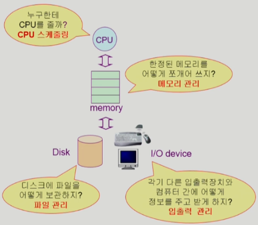

# 1장 강의 소개

### 운영체제란 무엇인가?

- 운영체제(Operating System, OS)란?
    - 컴퓨터 하드웨어 바로 위에 설치되어 사용자 및 다른 모든 소프트웨어와 하드웨어를 연결하는 소프트웨어 계층
        
        
        
- 협의의 운영체제(커널)
    - 운영체제의 핵심 부분으로 메모리에 상주하는 부분
- 광의의 운영체제
    - 커널 뿐 아니라 각종 주변 시스템 유틸리티를 포함한 개념

### 운영체제의 목표

- 컴퓨터 시스템의 자원을 효율적으로 관리
    - 프로세서, 기억장치, 입출력 장치 등의 효율적인 관리
        - 사용자간의 형평성 있는 자원 분배
        - 주어진 자원으로 최대한의 성능을 내도록
    - 사용자 및 운영체제 자신의 보호
    - 프로세스, 파일, 메시지 등을 관리
- 컴퓨터 시스템을 편리하게 사용할 수 있는 환경을 제공
    - 운영체제는 동시 사용자 / 프로그램 들이 각각 독자적 컴퓨터에서 수행되는 것 같은 환상을 제공
    - 하드웨어를 직접 다루는 복잡한 부분을 운영체제가 대행

### 운영체제의 분류

**동시 작업 가능 여부**

- 단일 작업(single tasking)
    - 한번에 하나의 작업만 처리
    - 예) MS-DOS
- 다중 작업(multi tasking)
    - 동시에 두 개 이상의 작업 처리
    - 예) UNIX, MS Windows

**사용자의 수**

- 단일 사용자(single user)
    - 예) MS-DOS, MS Windows
- 다중 사용자(multi user)
    - UNIX, NT user

**처리 방식**

- 일괄 처리(batch processing)
    - 작업 요청의 일정량을 모아서 한번에 처리
    - 작업이 완전 종료될 때까지 기다려야 함
    - 예) 초기 Punch Card 처리 시스템
- 시 분할(time sharing)
    - 여러 작업을 수행할 때 컴퓨터 처리 능력을 일정한 시간단위로 분할하여 사용
    - 일괄처리 시스템에 비해 짧은 응답 시간
    - interactive한 방식
    - 사람에 특화된 시스템
- 실시간(Realtime OS)
    - 정해진 시간 안에 어떠한 일이 반드시 종료됨이 보장되어야 하는 실시간 시스템을 위한 OS
    - 예) 원자로/ 공장 제어, 미사일 제어, 반도체 장비, 로봇 제어
- 실시간 시스템의 개념 확장
    - Hard Realtime System(경성 실시간 시스템)
    - Soft Realtime System(연성 실시간 시스템)

### 운영체제의 예

**UNIX - 대형 컴퓨터를 타겟으로 시작**

- 코드 대부분을 C언어로 작성
- 높은 이식성
- 최소한의 커널 구조
- 소스코드 공개
- 프로그램 개발에 용이
- 다양한 버전
    - System V, FreeBSD, SunOS, Solaris
    - Linux

**MS Windows - 단일 사용자, 단일 작업을 타겟으로 시작**

- MS사의 다중 작업용 GUI 기반 운영체제
- Plug and Play
- DOS용 응용 프로그램과 호환성 제공
- 불안정성
- 풍부한 지원 소프트웨어

DOS(Disk Operating System)

- MS사에서 1981년 IBM-PC를 위해 개발
- 단일 사용자용 운영체제, 메모리 관리 능력의 한계(주 기억장치 : 640KB)

### 운영체제의 구조

- 프로세스 관리
    - 프로세스의 생성과 삭제
    - 자원 할당 및 반환
    - 프로세스 간 협력
- 그 외
    - 보호 시스템
    - 네트워킹
    - 명령어 해석기(command line interpreter)