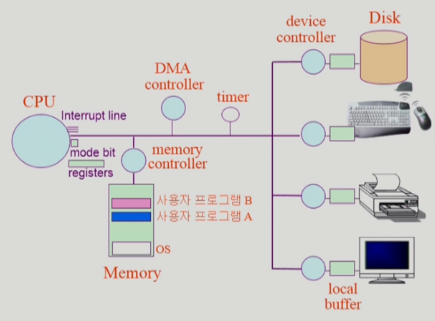

# 2장 Sysyem Structure & Program Execution

### 컴퓨터 시스템 구조



CPU에서 프로그램 A 또는 B 작업 중 타임 인터럽트 발생 시 제어권이 항상 OS로 넘어감

**mode bit**

모드 비트(Mode bit)는 컴퓨터 시스템에서 운영 체제와 사용자 프로그램 간의 권한 및 보안 관련 설정을 제어하는 비트입니다. 이 비트는 CPU의 제어 레지스터나 프로세서 상태 레지스터에 저장됩니다.

- Interrupt나 Exception 발생 시 하드웨어가 mode bit를 0으로 바꿈
- 사용자 프로그램에 CPU를 넘기기 전에 mode bit를 1로 바꿈

> 모드 비트는 보통 두 가지 상태를 나타내는데, "사용자 모드(User Mode)"와 "관리자(커널, 모니터) 모드(Supervisor Mode)"로 나뉩니다.
> 
> 
> 모드 비트의 역할은 다음과 같습니다:
> 
> 1. 권한 관리: 모드 비트는 운영 체제와 사용자 프로그램 간의 권한을 구분합니다. 사용자 모드에서 실행되는 프로그램은 제한된 자원과 기능에만 접근할 수 있으며, 시스템 리소스에 대한 직접적인 조작을 허용하지 않습니다. 반면, 관리자 모드에서 실행되는 운영 체제는 시스템 자원에 대한 완전한 접근 권한을 가지며, 하드웨어를 직접 제어하고 관리할 수 있습니다.
> 2. 보안 강화: 모드 비트는 시스템 보안을 강화하는 데 사용됩니다. 사용자 모드에서 실행되는 프로그램은 다른 프로그램이나 운영 체제의 중요한 부분에 손상을 주거나 악용하는 것을 방지하기 위해 제한된 권한을 갖습니다. 이를 통해 시스템의 안전성과 신뢰성을 유지할 수 있습니다.
> 3. 하드웨어 보호: 모드 비트는 하드웨어 리소스에 대한 보호를 제공합니다. 사용자 모드에서 실행되는 프로그램은 메모리, 입출력 장치, 인터럽트 등의 하드웨어 리소스에 직접 접근할 수 없으며, 운영 체제를 통해 간접적으로 접근합니다. 이를 통해 잘못된 접근 또는 악의적인 동작으로 인한 시스템 오류나 데이터 손실을 방지할 수 있습니다.

**Interrupt line**

> 외부 이벤트 처리: 인터럽트는 주변 장치나 외부 이벤트가 발생했을 때, CPU에게 해당 이벤트를 알리는 역할을 합니다. 예를 들어, 키보드가 눌려지거나, 마우스를 움직였을 때, 인터럽트가 발생하여 CPU는 해당 이벤트를 즉시 처리할 수 있습니다.
> 
> 1. 우선순위 관리: 여러 개의 인터럽트 신호가 동시에 발생하는 경우, 우선순위에 따라 어떤 인터럽트를 우선 처리해야 할지 결정합니다. 우선순위 레지스터에 저장된 값에 따라 인터럽트가 처리될 수 있도록 제어됩니다.
> 2. 예외 상황 처리: CPU가 실행 중인 프로그램에서 오류나 예외 상황이 발생했을 때, 인터럽트를 통해 해당 상황을 처리할 수 있습니다. 예를 들어, 0으로 나누기 오류가 발생하거나, 잘못된 메모리 접근이 있을 경우, CPU는 인터럽트를 통해 이에 대한 예외 처리를 할 수 있습니다.
> 3. 다중 작업 처리: 인터럽트는 다중 작업 시스템에서 여러 작업들 간의 전환을 가능하게 합니다. 예를 들어, 운영 체제는 CPU 시간을 작업들 사이에서 공평하게 나누기 위해 타이머 인터럽트를 사용할 수 있습니다. 타이머 인터럽트는 정해진 시간 간격마다 발생하여 CPU를 현재 실행 중인 작업에서 다음 작업으로 전환하도록 합니다.

**타이머**

- 정해진 시간이 흐른 뒤 운영체제에게 제어권이 넘어가도록 인터럽트를 발생시킴
- 타이머는 매 클럭 틱 마다 1씩 감소
- 타이머 값이 0이 되면 타이머 인터럽트 발생
- CPU를 특정 프로그램이 독점하는 것으로부터 보호

타이머는 time sharing을 구현하기 위해 널리 사용됨

타이머는 현재 시간을 계산하기 위해서 사용되기도 함

**Device Controller**

I/O device controller

- 해당 I/O 장치 유형을 관리하는 일종의 작은 CPU
- 제어 정보를 위해 control register, status register를 가짐
- local buffer를 가짐

I/O는 실제 device와 local buffer 사이에서 일어남

Device controller는 I/O가 끝났을 경우 interrupt로 CPU에 그 사실을 알림

```markdown
device driver(장치 구동기)
- OS 코드 중 각 장치별 처리 루틴 -> software

device controller(장치 제어기)
- 각 장치를 통제하는 일종의 작은 CPU -> hardware
```

DMA(Direct Memory Access) controller

- 인터럽트가 너무 자주 발생함
- Input이 들어오면 메모리에 넣고 CPU에게 보고

> DMA(Direct Memory Access) 컨트롤러는 컴퓨터 시스템에서 주변장치와 메인 메모리 간의 데이터 전송을 관리하는 장치입니다. CPU의 개입 없이 데이터를 전송하고, CPU의 부담을 줄여 시스템 성능을 향상시키는 역할을 수행합니다.
> 
> 
> DMA 컨트롤러의 주요 역할은 다음과 같습니다:
> 
> 1. 데이터 전송 관리: DMA 컨트롤러는 주변장치로부터 데이터를 읽거나 주변장치로 데이터를 쓰는 등의 데이터 전송 작업을 관리합니다. CPU는 DMA 컨트롤러에게 전송할 데이터의 위치, 크기, 목적지 등의 정보를 제공하고, DMA 컨트롤러는 해당 작업을 수행합니다. 이를 통해 CPU는 다른 작업에 집중할 수 있으며, 데이터 전송 속도가 향상됩니다.
> 2. 주변장치와 메모리 간의 중재: DMA 컨트롤러는 CPU와 주변장치 간의 메모리 접근 충돌을 방지하고 중재합니다. 주변장치가 데이터를 전송하거나 읽을 때, DMA 컨트롤러는 CPU와 주변장치 간의 충돌 없이 메모리에 접근할 수 있도록 조정합니다. 이를 통해 데이터 전송의 효율성과 안정성을 개선합니다.
> 3. 인터럽트 처리: DMA 컨트롤러는 데이터 전송이 완료되었을 때 인터럽트 신호를 발생시킵니다. CPU는 이 인터럽트를 감지하고, DMA 작업의 완료 여부를 확인할 수 있습니다. 이를 통해 CPU는 필요에 따라 데이터 전송 완료 후 추가적인 처리나 후속 작업을 수행할 수 있습니다.
> 
> DMA 컨트롤러는 주로 대용량 데이터 전송이 필요한 주변장치들과 함께 사용됩니다. 하드 디스크 드라이브(HDD), SSD, 그래픽 카드, 네트워크 카드 등이 DMA 컨트롤러를 사용하여 데이터를 메모리로 읽고 쓰는 작업을 수행합니다. DMA 컨트롤러의 사용은 데이터 전송의 효율성과 시스템 성능 향상에 큰 영향을 줍니다.
> 
> ---
> 
- 빠른 입출력 장치를 메모리에 가까운 속도로 처리하기 위해 사용
- CPU의 중재 없이 device controller가 device의 buffer storage의 내용을 메모리에 block 단위로 직접 전송
- 바이트 단위가 아니라 block 단위로 인터럽트를 발생시킴
    
    
    

### 인터럽트(Interrupt)

인터럽트 당한 시점의 레지스터와 program counter를 save한 후 CPU의 제어를 인터럽트 처리 루틴에 넘긴다

Interrupt(넓은 의미)

- Interrupt(하드웨어 인터럽트) : 하드웨어가 발생시킨 인터럽트
- Trap(소프트웨어 인터럽트)
    - Exception : 프로그램이 오류를 범한 경우
    - System Call : 프로그램이 커널 함수를 호출하는 경우

```markdown
인터럽트 벡터
- 해당 인터럽트의 처리 루틴 주소를 가지고 있음

인터럽트 처리 루틴(= Interrupt Service Routine, 인터럽트 핸들러)
- 해당 인터럽트를 처리하는 커널 함수
```

### 입출력(I/O)의 수행

모든 입출력 명령은 특권 명령

사용자 프로그램은 어떻게 I/O를 하는가?

시스템 콜(system call)

- 사용자 프로그램은 운영체제에게 I/O 요청

trap을 사용하여 인터럽트 벡터의 특정 위치로 이동

제어권이 인터럽트 벡터가 가리키는 인터럽트 서비스 루틴으로 이동

올바를 I/O 요청인지 확인 후 I/O 수행

I/O 완료 시 제어권을 시스템콜 다음 명령으로 옮김(하드웨어 인터럽트)

```markdown
시스템 콜
- 사용자 프로그램이 운영체제의 서비스를 받기 위해 커널 함수를 호출하는 것
```

---

### 동기식 입출력과 비동기식 입출력

- 동기식 입출력(syncronous I/O)
    - I/O 요청 후 입출력 작업이 완료된 후에야 제어가 사용자 프로그램에 넘어감
    - 구현방법 1
        - I/O가 끝날 때까지 CPU를 낭비시킴
        - 매 시점 하나의 I/O만 일어날 수 있음
    - 구현방법 2
        - I/O가 완료될 때까지 해당 프로그램에게서 CPU를 빼앗음
        - I/O 처리를 기다리는 줄에 그 프로그램을 줄 세움
        - 다른 프로그램에게 CPU를 줌
- 비동기식 입출력(asyncronous I/O)
    - I/O가 시작된 후 입출력 작업이 끝나기를 기다리지 않고 제어가 사용자 프로그램에 즉시 넘어감

두 경우 모두 I/O의 완료는 인터럽트로 알려줌


### 서로 다른 입출력 명령어

- I/O를 수행하는 special instruction에 의해
- Memory Mapped I/O에 의해
- 두 가지 메모리 접근 방식
    
    
    
    왼쪽 : 통상적인 경우
    
    - 메모리 접근하는 instruction 따로, I/O를 접근하기 위한 Device Address 따로
    
    오른쪽 : Memory Mapped I/O
    
    - I/O 디바이스에 메모리 주소를 매겨서 메모리 접근하는 instruction을 통해 I/O도 가능
    
    ### 저장장치 계층 구조
    
    
    
    제일 위에 CPU, 밑에 Register, Cache, Main Memory(DRAM) 순서
    
    위로갈 수록 비싸고, 빠르고 용량이 적어짐
    
    Primary : 휘발성 매체, 실행 가능함
    
    Secondary : 비휘발성 매체
    

### 프로그램의 실행(메모리 load)


보통 프로그램은 실행파일 형태로 하드 디스크에 저장

이런 파일을 실행시키면 메모리로 올라가서 프로세스가 됨. 정확하게는 물리적인 메모리로 올라가는게 아닌, virtual memory로 올라감.

어떤 프로그램을 실행시키면 그 프로그램의 주소 공간이 형성됨. 0번지부터 시작하는 독자적인 주소 공간

이러한 주소공간은 코드, 데이터, 스택 영역으로 구성.

- code : CPU에서 실행할 기계어 코드
- data : 자료 구조를 담고있음
- stack : 코드가 함수 구조로 되어 있기 때문에 어떤 데이터를 쌓았다가, 가져가는 등의 역할

이를 물리적인 메모리에 올려서 실행. 커널은 처음 부팅하고나면 항상 상주하고 있음. 프로그램들은 실행 시 생기고, 종료 시 사라짐. 가상 메모리에 있는 부분 중 당장 필요한 부분만 Physical memory에 올림. 이후, 사용되지 않으면 Swap area에 내려놓음

```jsx
virtual memory
- 각 프로그램들마다 독자적으로 가지는 가상 주소 공간
swap area
- 메모리 연장 공간으로서 사용하는 공간, 전원 꺼지면 다 사라짐
```

### 커널 주소 공간의 내용


- code 영역
    - 운영체제의 역할
        - 자원을 효율적으로 관리하기 위한 코드
        - 사용자에게 편리한 인터페이스 제공하기 위한 코드
    - 운영체제는 인터럽트가 들어오면 제어권을 가짐. 이 때 각각의 인터럽트마다 해야 할 인터럽트 처리와 관련된 내용이 들어가 있음
- data 영역
    - 여러 자료구조 정의
    - 운영체제는 하드웨어를 직접 관리 및 수정
    - 프로세스를 관리
        - 각 프로그램들이 독자적인 주소 공간을 가지고 있지만, 이를 관리하기 위한 자료구조가 필요함
        
        ```jsx
        PCB : Process Control Block
        ```
        
- stack 영역
    - 운영체제도 함수로 구성 - 함수를 호출하거나 리턴할 때 스택을 사용
    - 운영체제의 코드는 여러 프로그램들이 요청에 따라 쓸 수 있음
    - 스택을 쓸 때 어떤 사용자 프로그램이 CPU를 사용중인지를 알 수 있도록 함

### 사용자 프로그램이 사용하는 함수

함수(function)

- 사용자 정의 함수
    - 자신의 프로그램에서 정의한 함수
- 라이브러리 함수
    - 자신의 프로그램에서 정의하지 않고 갖다 쓴 함수
    - 자신의 프로그램의 실행파일에 포함되어 있다
- 커널 함수
    - 운영체제 프로그램의 함수
    - 커널 함수의 호출 = 시스템 콜

사용자 정의 함수, 라이브러리 함수 : 프로세스 A의 주소 공간

커널 함수 : 커널 주소 공간

### 프로그램의 실행

