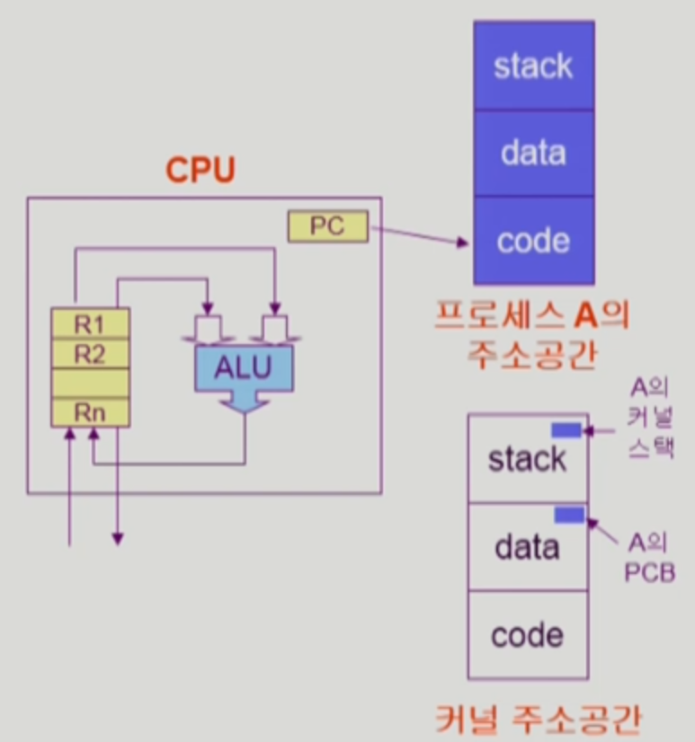

# 3장 Process

`Process is "**a program in execution"**`



### 프로세스의 개념

- 프로세스의 문맥(context)
    1. CPU의 수행 상태를 나타내는 하드웨어 문맥
        - Program Counter
        - 각종 register
    2. 프로세스의 주소 공간
        - code, data, stack
    3. 프로세스 관련 커널 자료구조
        - PCB(Process Control Block)
        - Kernel stack
- 프로세스는 상태(state)가 변경되며 수행된다
    
    
    
    - Running
        - CPU를 잡고 instruction을 수행중인 상태
    - Ready
        - CPU를 기다리는 상태(메모리 등 다른 조건을 모두 만족하고)
    - Blocked(wait, sleep)
        - CPU를 주어도 당장 instruction을 수행할 수 없는 상태
        - Process 자신이 요청한 event(예: I/O)가 즉시 만족되지 않아 이를 기다리는 상태
        - (예) 디스크에서 파일을 읽어와야 하는 경우
    - Suspended(stopped) - 중기 스케줄러에 의해 추가됨
        - 외적인 이유로 프로세스의 수행이 정지된 상태
        - 프로세스는 통채로 디스크에 swap out 됨
        - 예) 사용자가 프로그램을 일시정지 시킨 경우(break key)
            
            시스템이 여러 이유로 프로세스를 잠시 중단 시킴
            
            (메모리에 너무 많은 프로세스가 올라와 있을 때)
            
        
        ```markdown
        Blocked
        - 자신이 요청한 event가 만족되면 ready
        Suspended
        - 외부(중기 스케줄러 또는 사용자 break)에서 resume해 주어야 Active
        ```
        
    
    ---
    
    - 추가
        - New
            - 프로세스가 생성중인 상태
        - Terminated
            - 수행(execution)이 끝난 상태
            - 정리할게 남아있는 상태

### 프로세스의 상태


### Process Control Block(PCB)

- 운영체제가 각 프로세스를 관리하기 위해 프로세스당 유지하는 정보
    
    
    
- 다음의 구성 요소를 가짐(구조체로 유지)
    1. OS가 관리상 사용하는 정보
        - Process state, Process ID
        - scheduling information, priority
    2. CPU 수행 관련 하드웨어 값
        - Program Counter, Registers
    3. 메모리 관련
        - Code, Data, Stack의 위치 정보
    4. 파일 관련
        - Open file descriptors…

### 문맥 교환(Context Switch)

- CPU를 한 프로세스에서 다른 프로세스로 넘겨주는 과정
    
    
    
- CPU가 다른 프로세스에게 넘어갈 때 운영체제는 다음을 수행
    - CPU를 내어주는 프로세스의 상태를 그 프로세스의 PCB에 저장
    - CPU를 새롭게 얻는 프로세스의 상태를 PCB에서 읽어옴
- System Call이나 Interrupt 발생 시 반드시 context switch가 일어나는 것은 아님
    
    
    
    (1)의 경우에도 CPU 수행 정보 등 context의 일부를 PCB에 save해야 하지만 문맥 교환을 하는 (2)의 경우 그 부담이 훨씬 큼(eg. cache memory flush)
    

### 프로세스를 스케줄링하기 위한 큐

- Job queue
    - 현재 시스템 내에 있는 모든 프로세스의 집합
    - Ready queue나 Device queue에 있는 프로세스들을 포함함
- Ready queue
    - 현재 메모리 내에 있으면서 CPU를 잡아서 실행되기를 기다리는 프로세스의 집합
- Device queues
    - I/O device의 처리를 기다리는 프로세스의 집합
- 프로세스들은 각 큐들을 오가며 수행된다

### Ready Queue와 다양한 Device Queue


> **하림: 위 그림에 대해 좀 더 자세히 설명해주세요 head와 tail이 무엇을 뜻하는 건가요 unit0, 1은 뭔가요?**
위 그림은 실제 시스템에서 이런 큐가 어떻게 관리되는지를 자료구조의 큐 형태로 나타낸 그림입니다. 가장 상단에 위치한 큐가 Ready Queue이고, 그 아래로 Magnetic Tape 0번, 1번이 있고, 그 아래로 디스크, 터미널 순서로 옵니다. 큐에 줄 세우는 것들은 “프로세스가 관리하는 PCB를 줄세운다” 라고 생각하면 될 것 같습니다. 위 PCB 그림을 보면 가장 첫 번째 블록에 pointer가 존재합니다. 이 포인터를 연결하여 큐를 생성합니다. 이 프로세스를 다양한 큐에 줄세워서 서비스를 제공하게 되고, 운영체제가 이를 관리하는 것입니다.

Queue Header에서 head와 tail은 Queue의 요소들이 저장되는 위치를 가리키는 포인터 입니다.
- head : Queue에서 데이터가 제거되는 위치를 가리키는 포인터 입니다.
- tail : Queue에서 데이터가 추가되는 위치를 가리키는 포인터 입니다.

unit 0과 unit 1은 일반적으로 해당 큐의 크기를 표현하는 값이며, 이 큐의 크기는 디바이스의 수나 운영 체제의 정책에 따라 조정될 수 있다고 합니다. 
  하지만, 그림과 교수님께서 설명하신 맥락 상으로는 다른 의미를 내포하고 있다고 봅니다. 그림을 설명하시면서 magnetic tape 0번, 1번이라 말씀하셨고, 그림에서 표현된 것과 같이 이름이 겹치는 Device Queue를 식별하기 위한 0번 유닛, 1번 유닛 정도로 이해하는것이 좋을 것 같습니다(해당 부분은 다른 의견 있으면 공유 부탁드려요🙏)
> 


- 프로그램이 실행되게 되면 Ready Queue가서 줄 섬
- 언젠가 자기 차례가 되어 CPU를 얻음
- 얻은 상황에서 자신이 계속 쓰고싶지만 할당 시간이 끝나면 다시 Ready Queue에 가서 줄 섬
- I/O와 같은 시간이 오래걸리는 작업을 수행하면 해당 작업을 수행하는 Queue로 가서 줄서서 처리하고 돌아와서 다시 Ready Queue
- 자식 프로세스가 생길 수도 있음. 이 때는 본인은 CPU를 놓고 ready queue로 가서 줄섬
- 인터럽트가 생기면 정확히는 인터럽트 서비스 루틴(ISR : Interrupt Service Routine)이 호출
    
    > 프로세스가 CPU 제어권을 가진 상태에서 인터럽트가 발생하면 해당 프로세스는 Ready Queue로 돌아가는 것이 아니라, 인터럽트 서비스 루틴(ISR)을 실행한 후 인터럽트 처리가 완료되면 실행을 재개합니다. 인터럽트 처리 도중에 다른 프로세스가 CPU를 사용할 수도 있습니다.
    > 
- 본인의 작업이 끝나면 CPU 밖으로 빠져나감

### 스케줄러(Scheduler)

- Long-term Scheduler(장기 스케줄러 or Job Scheduler)
    
    `**메모리에 올라가있는 프로세스의 수를 제어하는게 장기 스케줄러의 역할**`
    
    - `어떤 프로세스가 new 상태에서 메모리를 얻고 ready로 넘어가는 것을 제어`
    - 시작 프로세스 중 어떤 것들을 ready queue로 보낼지 결정
    - 프로세스에 memory(및 각종 자원)을 주는 문제
    - **degree of Multiprogramming을 제어**
    - time sharing system에는 보통 장기 스케줄러가 없음(무조건 ready)
    - 요새는 이런 스케줄러가 **없고** 다 올리는데 너무 많아지면 중기 스케줄러에서 제어함
    
    > **영서: 왜 장기 스케줄러를 현대의 OS는 잘 쓰지 않는 것인지 여쭤봐도 되는지 여쭤보는 것을 허락받을 수 있을까요?**
    > 
    > 1. 다중 사용자와 다중 프로그래밍 환경: 현대의 운영 체제는 다중 사용자 환경을 지원하며, 여러 개의 프로세스가 동시에 실행될 수 있습니다. 이러한 환경에서는 중간 단계의 스케줄링이 필요하지 않을 수 있습니다. 대부분의 운영 체제는 중기 스케줄러를 사용하여 실행 가능한 프로세스를 선택하고 실행합니다.
    > 2. 시분할 시스템: 현대의 운영 체제는 대부분 시분할 시스템을 지원합니다. 시분할 시스템은 사용자에게 실시간 응답성을 제공하기 위해 작업을 작은 시간 단위로 분할하여 실행합니다. 이를 위해 단기 스케줄러가 사용되며, 장기 스케줄러의 역할은 상대적으로 줄어들었습니다.
- Short-term Scheduler(단기 스케줄러 or CPU Scheduler)
    - 어떤 프로세스를 다음번에 running 시킬지 결정
    - 프로세스에 CPU를 주는 문제
    - 충분히 빨라야 함(ms 단위)
- Medium-term Scheduler(중기 스케줄러 or Swapper)
    - `여유 공간 마련을 위해 프로세스를 통채로 메모리에서 디스크로 쫒아냄`
    - 프로세스에게서 memory를 뺏는 문제
    - **degree or Multiprogramming을 제어**

### 프로세스 상태도


- Running을 두 가지로 나눔
    - user mode(본인의 코드를 실행)
    - kernel mode(운영체제에 sysem call, interrupt, trap 등)
        - 이 때는 운영체제가 관리 상 나눈것 뿐이지 본연의 상태를 나타내는 것이 아님
        - `사용자 프로그램이 kernel mode에서 실행중이다` 라고 함
- 외부적인 요인으로 시스템이 얼어붙은 상태로 inactive 상태로 분류
    - Suspended 상태에는 메모리를 완전히 잃어버리는 swap out 상태

### Thread

- 프로세스 내부에 CPU 수행 단위가 여러 개 있는 경우 Thread라 부름
- 프로세스가 하나 주어지면 code, data, stack으로 된 주소 공간이 생기는데, 이 프로세스 하나를 관리하기 위한 운영체제 내부에 PCB가 있음. 이  PCB 내부에 어디를 실행중인지를 가르키는 PC가 있음. 이 때, 어떤 동일한 일을 하는 프로세스가 있다고 가정하면 메모리가 낭비가 됨. 그래서 주소공간을  하나만 사용하면서 쓰레드의 갯수마다 어디를 가르키는지 나타내는 PC만 여러개를 두는 것
    
    
    

`A thread(or lightweight process) is a basic unit of CPU utilization`

- Thread의 구성
    - Program Counter
    - register set
    - stack space
- Thread가 동료 thread와 공유하는 부분(=task)
    - code section
    - data section
    - OS resources
- 전통적인 개념의 heavyweight process는 하나의 thread를 가지고 있는 task로 볼 수 있다
- 다중 스레드로 구성된 태스크 구조에서는 하나의 서버 스레드가 blocked(waiting) 상태인 동안에도 동일한 태스크 내의 다른 스레드가 실행(running)되어 빠른 처리를 할 수 있다
- 동일한 일을 수행하는 다중 스레드가 협력하여 높은 처리율(throughput)과 성능 향상을 얻을 수 있다
- 스레드를 사용하면 병렬성을 높일 수 있다

### Thread의 장점

- 응답성
- 자원 공유
- 경제성
- Utilization of Multi-Processing Architectures
    - 각각의 스레드는 다른 프로세스 내에서 병렬적으로 실행 가능

### Implementation of Threads

- Kernel Threads
    - 운영체제에서 스레드의 존재를 알고 있음
- User Threads
    - 운영체제는 스레드의 존재를 모름. 따라서 특정 환경에서는 제약조건이 존재