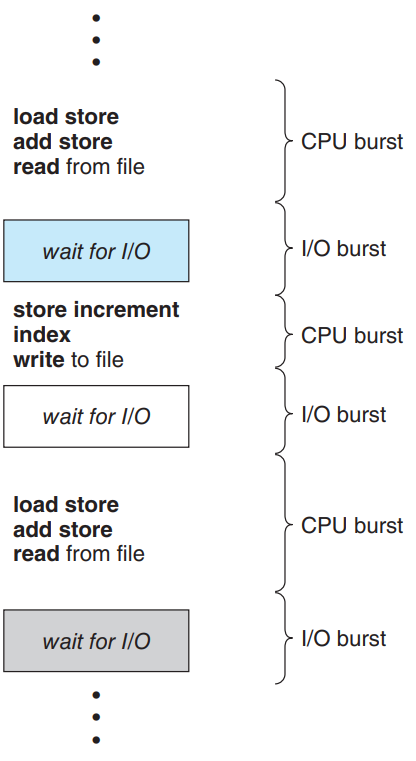

# 5장 CPU Scheduling

### CPU and I/O Bursts in Program Execution

어떤 프로그램이든 실행이 되면 아래 과정을 거침.

프로그램의 Path는 CPU만 연속적으로 하는 단계와 I/O만 하는 단계가 번갈아 실행됨. 이 CPU만 연속적으로 실행하는 단계를 CPU Burst, I/O를 실행하는 단계를 I/O Burst라고 표현함. 단, 프로그램에 따라 스위칭하는 빈도나 주기가 다름.

### CPU-Burst Time의 분포

- CPU Burst가 짧다 == I/O가 중간에 많이 끼어져있다
- 여러 종류의 job(=process)이 섞여있기 때문에 CPU 스케줄링이 필요하다.
    - interactive job에게 적절한 response 제공 요망
    - CPU와 I/O 장치 등 시스템 자원을 골고루 효율적으로 사용

### 프로세스의 특성 분류

프로세스는 그 특성에 따라 두 가지로 나눔

- I/O-bound process
    - CPU를 잡고 계산하는 시간보다 I/O에 많은 시간이 필요한 job
    - (many short CPU bursts)
- CPU-bound process
    - 계산 위주의 job
    - (few very long CPU bursts)

### CPU Scheduler & Dispatcher

- CPU Scheduler
    - Ready 상태의 프로세스 중에서 이번에 CPU를 줄 프로세스를 고른다
- Dispatcher
    - CPU의 제어권을 CPU scheduler에 의해 선택된 프로세스에게 넘긴다
    - 이 과정을 context switch(문맥 교환)이라고 한다
- CPU 스케줄링이 필요한 경우는 프로세스에게 다음과 같은 상태 변화가 있는 경우이다.
    1. Running → Blocked(예 : I/O 요청하는 시스템 콜)
    2. Running → Ready(예 : 할당 시간 만료로 timer interrupt)
    3. Blocked → Ready(예 : I/O 완료 후 인터럽트)
    4. Terminate

⭐ 1, 4에서의 스케줄링은 **nonpreemptive**(=강제로 뺏지 않고 자진 반납 : 비선점형)

⭐ 나머지 스케줄링은 **preemptive**(=강제로 빼앗음 : 선점형)

### Scheduling Criteria(성능 척도)

⭐ 매 CPU Burst마다 계산하는 것(프로세스가 시작되고 종료되는 개념 X)

**시스템 입장에서의 성능 척도**

- CPU utilization(이용률)
    - 전체 시간 중에서 CPU가 놀지 않고 일한 시간을 의미
    - 가능한 한 CPU를 가장 많이 사용하고자 합니다. 개념적으로 CPU 이용률은 0에서 100%까지 범위를 가질 수 있습니다. 실제 시스템에서는 가벼운 부하 시스템의 경우 40%부터 많은 부하 시스템의 경우 90%까지 범위 내에서 유지되어야 합니다. (Linux, macOS 및 UNIX 시스템에서 top 명령을 사용하여 CPU 이용률을 얻을 수 있습니다.)
- Throughput(처리량)
    - 주어진 시간동안 얼만큼의 일을 처리했는지는 나타내는 척도
    - CPU가 프로세스를 실행하는 동안 작업이 수행됩니다. 작업의 측정 단위로는 단위 시간당 완료된 프로세스의 수인 처리량이 있습니다. 긴 프로세스의 경우 몇 초에 하나의 프로세스일 수 있고, 짧은 트랜잭션의 경우 초당 수십 개의 프로세스가 될 수 있습니다.

**프로그램(고객)입장에서의 성능 척도** - 시간과 관련된 성능 척도

- Waiting time(대기시간)
    - CPU 스케줄링 알고리즘은 프로세스의 실행 시간이나 I/O 수행 시간에 영향을 주지 않습니다. 그저 프로세스가 준비 큐에서 대기하는 시간만 영향을 받습니다. 대기 시간은 준비 큐에서 대기하는 기간의 합입니다.
- Turnaround time(소요시간, 반환시간)
    - 특정 프로세스의 관점에서 가장 중요한 기준은 해당 프로세스의 실행에 소요되는 시간입니다. 프로세스 제출 시간부터 완료 시간까지의 간격을 반환 시간이라고 합니다. 반환 시간은 준비 큐에서 대기하는 시간, CPU에서 실행되는 시간 및 I/O를 수행하는 시간의 합입니다.
    - CPU 쓴 시간 + 중간중간 기다리는 시간 = 들어와서 나가기 까지
- Response time(응답시간)
    - 대화형 시스템에서는 반환 시간이 가장 적합한 기준이 되지 않을 수 있습니다. 종종 프로세스는 초기에 어떤 출력을 생성하고 이전 결과가 사용자에게 출력되는 동안 새로운 결과를 계산하는 동안 계속해서 작업을 수행할 수 있습니다. 따라서 다른 측정 항목으로는 요청이 제출된 시점부터 첫 번째 응답이 생성되는 시간을 나타내는 응답 시간이 있습니다. 응답 시간은 응답을 시작하는 데 걸리는 시간이며 응답을 출력하는 데 걸리는 시간이 아닙니다.

**Waiting time *VS* Response time**

Waiting time

- 특정 프로세스가 준비큐에서 대기하는 시간 + CPU Burst 중간중간 일어나는 인터럽트로 인한 대기시간까지 포함

Response time

- 특정 프로세스가 준비큐에서 대기하다가 처음 CPU Burst로 넘어가기까지 걸리는 시간

## Scheduling Algorithms

### FCFS(First-Come First-Served)

P1 : 24 → P2 : 3 → P3 : 3

- 프로세스의 도착 순서대로 먼저 진행하는 스케줄링 알고리즘
- 비선점형 방식(Nonpreemptive)
- 효율적이진 않음(평균 대기시간 = 17)
- 바로 직전 프로세스의 상태에 따라 효율성이 매우 많이 달라짐(Convoy effect)

### SJF(Shortest-Job First)

- CPU Burst가 가장 짧은 프로세스를 우선적으로 처리하는 스케줄링 알고리즘
- 평균 대기 시간이 가장 짧아짐
- Nonpreemptive
    - 일단 CPU를 잡으면 이번 CPU Burst가 완료될 때까지 CPU를 선점 당하지 않음
    
    
    
    
    
- Preemptive
    - 현재 수행중인 프로세스의 남은 burst time보다 더 짧은 CPU Burst time을 가지는 새로운 프로세스가 도착하면 CPU를 빼앗김
    - 이 방법을 **Shortest-Remaining-Time-First(SRTF)**라고도 부름
    
    
    
    
    
- Starvation(기아)
    - CPU Burst가 매우 긴 프로세스의 경우 실행되지 않을 수 있는 문제 발생
- CPU Burst time을 미리 알 수 없음
    - 과거의 실행했던 시간을 토대로 추측해서 사용
        - exponential averaging
            
            
            
            - 요약하면 최근 실행된 Bust 시간은 많이 반영하고, 오래된 Burst 시간일 수록 덜 반영하는 식 완성

### Priority Scheduling

- highest priority를 가진 프로세스에게 CPU 할당
- smallest integer = highest priority
- (면접노트)오래된 작업일 수록 우선순위를 높이는 방법(Aging)을 통해 단점을 보완한 알고리즘
- SJF는 일종의 Priority Scheduling 이다
    - priority = predicted next  CPU burst time
- Nonpreemptive
    - 우선순위가 더 높은 프로세스가 도착해도 해당 프로세스가 마무리 될 때까지 기다림
- Preemptive
    - 지금 우선순위가 제일 높은 프로세스를 실행중인데, 더 높은 우선순위 프로세스가 도착했을 때 빼았는 경우

### Round Robin(RR)

- 현대 컴퓨터가 쓰는 스케줄링인 우선순위 스케줄링(priority scheduling)의 일종으로 각 프로세스는 동일한 시간(일반적으로 10 ~ 100ms)을 할당받고 그 안에 끝나지 않으면 선점(preempted) 당하고 다시 준비 큐(ready queue)의 제일 뒤로가는 알고리즘
- 일반적으로 전체 작업 시간은 길어지지만 평균 응답 시간은 짧아진다는 특징
- 전체 대기시간이 사용시간에 비례하게 나타난다는 특징
- 로드 밸런서에서 트래픽 분산 알고리즘으로도 쓰임
- 할당시간 Q가 커지면 FCFS, 작아지면 context switch  오버헤드가 커짐
- Preemptive
    
    
    
    
    

### Multilevel Queue

- 우선순위에 따라 스케줄링 해주는 기법
- Ready Queue를 여러 개로 분할
    - foreground(interactive)
    - background(batch - no human interaction)
- 각 큐는 독립적인 스케줄링 알고리즘을 가짐
    - foreground - (RR)
    - background - (FCFS)
- 큐에 대한 스케줄링이 필요
    - Fixed priority scheduling
        - serve all from foreground then from background
        - Possibility of starvation
    - Time slice
        - 각 큐에 CPU time을 적절한 비율로 할당
        - 예) 80%는 foreground in RR, 20%는 background in FCFS

### Multilevel Feedback Queue

- 프로세스가 다른 큐로 이동 가능
- 에이징(Aging)을 이와 같은 방식으로 구현 가능
- Multilevel Feedback Queue scheduler를 정의하는 파라미터
    - Queue의 수
    - 각 큐의 scheduling algorithm
    - Process를 상위 큐로 보내는 기준
    - Process를 하위 큐로 내쫒는 기준
    - 프로세스가 CPU 서비스를 받으려 할 때 들어갈 큐를 결정하는 기준

> **Example of Miltileve Feedback Queue**
> 
> 
> 
> 
> - Three queues
>     - Q0 - time quantum 8ms
>     - Q1 - time quantum 16ms
>     - Q2 - FCFS
> - Scheduling
>     - new job이 Q0로 들어감
>     - CPU를 잡아서 8ms동안 수행됨
>     - 8ms동안 다 끝내지 못했으면 Q1으로 내려감
>     - Q1에서 기다렸다가 CPU를 잡아서 16ms동안 수행됨
>     - 16ms에 끝내지 못한경우 Q2로 쫓겨남

### Multiple-Processor Scheduling

- CPU가 여러 개인 경우 스케줄링은 더욱 복잡해짐
- Homegeneous processor인 경우
    - Queue에 한줄로 세워서 각 프로세서가 알아서 꺼내가게 할 수 있다.
    - 반드시 특정 프로세서에서 수행되어야 하는 프로세스가 있는 경우에는 문제가 더 복잡해짐
- Load sharing
    - 일부 프로세서에 job이 몰리지 않도록 부하를 적절히 공유하는 메커니즘 필요
    - 별개의 큐를 두는 방법 vs 공동 큐를 사용하는 방법
- Symmetric Multiprocessing(SMP)
    - 각 프로세서가 각자 알아서 스케줄링 결정
- Asymmetric Multiprocessing
    - 하나의 프로세서가 시스템 데이터의 접근과 공유를 책임지고 나머지 프로세서는 거기에 따름

### Real-Time Scheduling

- Hard real-time systems
    - Hard real-time task는 정해진 시간 안에 반드시 끝나도록 스케줄링 해야 함
- Soft real-time computing
    - Soft real-time task는 일반 프로세스에 비해 높은 priority를 갖도록 해야 함

### Thread Scheduling

- Local Scheduling
    - User leve thread의 경우 사용자 수준의 thread library에 의해 어떤 thread를 스케줄할지 결정
- Global Scheduling
    - Kernel level thread의 경우 일반 프로세스와 마찬가지로 커널의 단기 스케줄러가 어떤 thread를 스케줄할지 결정

### Algorithm Evaluation

Queueing models

- 확률 분포로 주어지는 arrival rate와 service rate등을 통해 각종 performance index 값을 계산

Implementation(구현) & Measurement(성능 측정)

- 실제 시스템에 알고리즘을 구현하여 실제 작업(workload)에 대해서 성능을 측정 비교

Simulation(모의 실험)

- 알고리즘을 모의 프로그램으로 작성 후 trace를 입력으로 하여 결과 비교