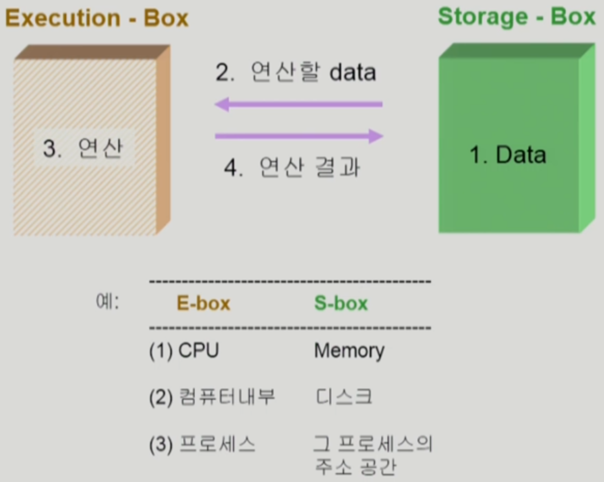

# 6장 Process Synchronization

### 데이터의 접근



### Race Condition


### OS에서 race condition은 언제 생기는가?

1. kernel 수행 중 인터럽트 발생 시
2. Process가 system call을 하여 kernel mode로 수행 중인데 context switch가 일어나는 경우
3. Multiprocessor에서 shared memory 내의 kernel data

### interrupt handler VS kernel


### Preempt a process running in kernel


- 두 프로세스의 address space 간에는 data sharing이 없음
- 그러나 sysemcall을 하는 동안에는 kernel address space의 data를 access하게 됨(share)
- 이 작업 중간에 CPU를 preempt해가면 race condition 발생

### If you preempt CPU while in kernel mode


- 해결책
    - 커널 모드에서 수행 중일 때는 CPU를 preempt하지 않음.
    - 커널 모드에서 사용자 모드로 돌아갈 때 preempt

### OS에서의 race condition


- 어떤 CPU가 마지막으로 count를 store했는가? → race condition
- multiprocessor의 경우 interrupt enable/disable로 해결 불가능

해결방법

1. 한 번에 하나의 CPU만이 커널에 들어갈 수 있게 하는 방법
2. 커널 내부에 있는 각 공유 데이터에 접근할 때마다 그 데이터에 대한 lock / unlock을 하는 방법

### Process Synchronization 문제

- 공유 데이터(shared data)의 동시 접근(concurrent access)은 데이터의 불일치 문제(inconsistency)를 발생시킬 수 있다
- 일관성(consistency) 유지를 위해서는 협력 프로세스(cooperating process)간의 실행순서(orderly execution)를 정해주는 메커니즘 필요
- **Race Condition**
    - 여러 프로세스들이 동시에 공유 데이터를 접근하는 상황
    - 데이터의 최종 연산 결과는 마지막에 그 데이터를 다룬 프로세스에 따라 달라짐
- race condition을 막기 위해서는 concurrent process는 동기화(synchronize)되어야 한다

### The Critical-Section Problem

- n개의 프로세스가 공유 데이터를 동시에 사용하기를 원하는 경우
- 각 프로세스의 code segment에는 공유 데이터를 접근하는 코드인 ***ciritical section***이 존재
- Problem
    - 하나의 프로세스가 critical section에 있을 때 다른 모든 프로세스는 critical section에 들어갈 수 없어야 한다
    
    
    

---

### Initial Attempts to Sole Problem

- 두 개의 프로세스가 있다고 가정 P0, P1
- 프로세스들의 일반적인 구조
    
    ```markdown
    do{
    	entry section
    	critical section
    	exit section
    	remainder section
    }while(1)
    ```
    
- 프로세스들은 수행의 동기화(synchronize)를 위해 몇몇 변수를 공유할 수 있다
    
    → synchronization variable
    

### 프로그램적 해결법의 충족조건

- Mutual Exclusion(상호배제)
    - 프로세스 Pi가 critical section 부분을 수행중이면 다른 모든 프로세스들은 그들의 critical section에 들어가면 안된다
- Progress(진행)
    - 아무도 critical section에 있지 않은 상태에서 critical section에 들어가게 해주어야 한다
- Bounded Waiting(유한대기)
    - 프로세스가 critical section에 들어가려고 요청한 후부터 그 요청이 허용될 때까지 다른 프로세스들이 critical section에 들어가는 횟수에 한계가 있어야 한다
- 가정
    - 모든 프로세스의 수행속도는 0보다 크다
    - 프로세스들 간의 상대적인 수행 속도는 가정하지 않는다

⭐어떻게 Algorithm적으로 lock을 걸고 풀거냐?

### Algorithm 1

Synchronization variable

int turn;

initially turn = 0; ⇒ P(i) can enter its critical section if(turn == i)

- Process P0
    
    ```c
    do{
    	while(turn != 0); /*My turn?*/
    	critical section
    	turn = 1;         /*now it's your turn*/
    	remainder section
    }while(1)
    ```
    
- Satisfies mutual exclusion, **but not progress**
    
    즉, 과잉 양보 : 반드시 한번씩 교대로 들어가야만 함(swap-turn)
    
    다른 프로세스가 turn을 내 값으로 바꿔줘야만 내가 들어갈 수 있음
    
    특정 프로세스가 더 빈번히 critical section을 들어가야 한다면?
    
- Progress를 만족하지 않음
- 다른 프로세스의 빈도에 영향을 받음

### Algorithm 2

- Synchronization variables
    - boolean flag[2];
        - initially flag[all] = false;
    - P(i) ready to enter its critical section if(flag[i] == true)
- Process P(i)
    
    ```c
    do{
    	flag[i] = true;
    	while (flag[j]);
    		critical section
    		flag[i] = false;
    	remainder section;
    }while(1)
    ```
    
- Satisfies mutual exclusion, but not progress requirement
- 둘 다 2행까지 수행 후 끊임없이 양보하는 상황 발생 가능

### Algorithm 3(Peterson’s Algorithm)

- combined Synchronization variables of algorithms 1 and 2
- Process P(i)
    
    ```c
    do{
    	flag[i] = true;
    	turn = j;
    	while (flag[j] && turn == j);
    	critical section
    	flag[i] = false;
    	remainder section
    }while(1)
    ```
    
- meets all three requirements; solves the critical section problem for two processes
- Busy Waiting!(=spin lock)(계속 CPU와 메모리를 쓰면서 기다림)

### Synchronization Hardware

- 하드웨어적으로 Test & modify를 atomic하게 수행할 수 있도록 지원하는 경우 앞의 문제는 간단히 해결
    
    
    
- Mutual Exclusion with Test & Set
    
    ```c
    Synchronization variable
    	boolean lock = false;
    Process P(i)
    	do{
    		while (Test_and_Set(lock));
    		critical section
    		lock = false;
    		remainder section
    	}while(1)
    ```
    

### Semaphores

- 앞의 방식들을 추상화 시킴
- Semaphore S
    - integer variable
    - 아래의 두 가지 atomic 연산에 의해서만 접근 가능
    - P연산 : lock을 거는 연산
    - V연산 : lock을 푸는 연산
    
    ```c
    P(S) : while (S <= 0) do no-op;
    			 S--;
    ```
    
    - If positive, decrement - & - enter.
    - Otherwise, wait until positive(busy-wait)
    
    ```c
    V(S) :
    			 S++;
    ```
    

### Critical Section of n Processes

Synchronization variable

semaphore mutex; /*initially 1 : 1개가 CS에 들어갈 수 있다*/

Process P(i)

```c
do{
	P(mutex);  /*if positive, dec & enter, otherwise, wait*/
	critical section
	V(mutex);
	remainder section
}while(1)
```

- busy-wait는 효율적이지 못함(=spin lock)
- Block & Wakeup 방식의 구현(=sleep lock)

### Block / Wakeup Implementation

- Semaphore를 다음과 같이 정의
    
    ```c
    typeof struct{
    	int value;          /*semaphore*/
    	struct process *L;  /*process wait queue*/
    } semaphore;
    ```
    
- block과 wakeup을 다음과 같이 가정
    - block
        - 커널은 block을 호출한 프로세스를 suspend 시킴
        - 이 프로세스의 PCB를 semaphore에 대한 wait queue에 넣음
    - wakeup(P)
        - block된 프로세스 P를 wakeup 시킴
        - 이 프로세스의 PCB를 ready queue로 옮김
    
    
    

### Implementation


### Which is better?

- Busy-wait VS Block/Wakeup
- Block/wakeup overhead VS Critical section 길이
    - Critical section의 길이가 긴 경우 Block/Wakeup이 적당
    - Critical section의 길이가 짧은 경우 Block/Wakeup 오버헤드가 busy-wait 오버헤드보다 커질 수 있음
    - 일반적으로는 Block/Wakeup방식이 더 좋음

### Two Types of Semaphores

- Counting Semaphore
    - 도메인이 0 이상인 임의의 정수 값
    - 주로 resource counting에 사용
- Binary Semaphore(=mutex)
    - 0 또는 1값만 가질 수 있는 semaphore
    - 주로 mutual exclusion(lock/unlock)에 사용

### Deadlock and Starvation

- Deadlock
    - 둘 이상의 프로세스가 서로 상대방에 의해 충족될 수 있는 event를 무한히 기다리는 현상
- S와 Q가 1로 초기화된 semaphore라 하자
    
    
    
- Starvation
    - indefinite blocking - 프로세스가 suspend된 이유에 해당하는 세마포어 큐에서 빠져나갈 수 없는 현상

## Classical Problems of Synchronization

### Bounded-Buffer Problem(Producer-Consumer Problem)


Shared data

- buffer 자체 및 buffer 조작 변수(empty/full buffer의 시작 위치)

Synchronization variables

- mutual exclusion → Need binary semaphore(shared data의 mutual exclusion을 위해)
- resource count → Need integer semaphore(남은 full/empty buffer의 수 표시)

**Implementation**

Synchronization variables

semaphore full = 0, empty = n, mutex = 1;


### Readers and Writers Problem

- 한 process가 DB에 write 중일 때 다른 process가 접근하면 안됨
- read는 동시에 여럿이 해도 됨
- solution
    - Writer가 DB에 접근 허가를 아직 얻지 못한 상태에서는 모든 대기중인 Reader들을 다 DB에 접근하게 해준다
    - Writer는 대기중인 Reader가 하나도 없을 때 DB 접근이 허용된다
    - 일단 Writer가 DB에 접근중이면 Reader들은 접근이 금지된다
    - Writer가 DB에서 빠져나가야만 Reader의 접근이 허용된다
- Shared data
    - DB 자체
    - readcount; /*현재 DB에 접근중인 Reader의 수*/
- Synchronization variables
    - mutex /*공유 변수 readcount를 접근하는 코드(critical section)의 mutual exclusion 보장을 위해 사용*/
    - db /*Reader와 writer가 공유 DB 자체를 올바르게 접근하게 하는 역할*/

**Implementation**

Shared data

int readcount = 0;

DB 자체;

Synchronization variables

semaphore mutex = 1, db = 1;


### Dining-Philosophers Problem

Synchronization variables

semaphore chopstick[5] /*initially all values are 1*/


- 앞의 solution의 문제점
    - Deadlock 가능성 있다
    - 모든 철학자가 동시에 배가 고파져서 왼쪽 젓가락을 잡아버린 경우
- 해결 방안
    - 4명의 철학자만이 테이블에 동시에 앉을 수 있도록 한다
    - 젓가락을 두개 모두 집을 수 있을 때만 젓가락을 집을 수 있게 한다
    - 비대칭
        - 짝수(홀수) 철학자는 왼쪽(오른쪽) 젓가락부터 집도록
    
    
    

# Monitor

- 둘 이상의 스레드나 프로세스가 공유 자원에 안전하게 접근할 수 있도록 공유 자원을 숨기고 해당 접근에 대해 인터페이스만 제공
    
    
    

프로세스 간의 상호작용 및 동기화를 제어하기 위한 개념입니다. 프로세스 동기화는 여러 프로세스가 동시에 공유 자원에 접근하거나 작업을 수행할 때 발생하는 문제를 해결하기 위해 사용됩니다.

- Semaphore의 문제점
    - 코딩하기 힘들다
    - 정확성(correctness)의 입증이 어렵다
    - 자발적 협력(voluntary cooperation)이 필요하다
    - 한번의 실수가 모든 시스템에 치명적 영향
    - 예
        
        
        
- 동시 수행중인 프로세스 사이에서 abstract data type의 안전한 공유를 보장하기 위한 high-level synchronization construct
    
    
    
    
    

> 수형: monitor에서 entryqueue에 대기되는 process와 condition variable에 full, empty로 대기되는 process의 차이에 대해 설명해주세요…. 머리가 좀 얼큰해지는데
> 
> 
> > entryqueue에 대기하는 프로세스는 critical section에 들어가기 위해 다른 프로세스가 빠져나올 때까지 대기합니다. 이는 한 번에 하나의 프로세스만 critical section에 접근하도록 제한하는 역할을 합니다.
> 반면에 condition variable에 full, empty로 대기하는 프로세스는 공유 자원의 상태에 따라 작업을 조절하기 위해 대기합니다. 예를 들어, 생산자는 버퍼가 가득 찰 때까지, 소비자는 버퍼가 비어있을 때까지 대기합니다. 이는 공유 자원의 상태에 따라 작업을 수행하기 위한 것입니다.
> > 
- 모니터 내에서는 한번에 하나의 프로세스만이 활동 가능
- 프로그래머가 동기화 제약 조건을 명시적으로 코딩할 필요 없음
- 프로세스가 모니터 안에서 기다릴 수 있도록 하기 위해 condition variable 사용
    
    `condition x, y;`
    
- Condition variable은 wait와 signal 연산에 의해서만 접근 가능
    
    `x.wait();`
    
    x.wait()을 invoke한 프로세스는 다른 프로세스가 x.signal()을 invoke하기 전까지 suspend된다
    
    `x.signal();`
    
    x.signal()은 정확하게 하나의 suspend된 프로세스를 resume한다.
    
    Suspend된 프로세스가 없으면 아무 일도 일어나지 않는다
    

### Bounded-Buffer Problem


### Dining Philosophers Example


### 세마포어와 모니터의 목적

- 세마포어
    - 세마포어는 주로 공유 자원의 동시 접근을 제어하기 위해 사용됩니다.
    - 여러 프로세스가 공유 자원에 접근하는 순서를 조정하고, 상호 배제와 동기화를 달성할 수 있습니다. 세마포어는 저수준의 동기화 메커니즘이며, 개발자가 직접 세마포어를 조작해야 합니다.
- 모니터
    - 고급 프로그래밍 언어에서 제공되는 동기화 추상화입니다.
    - 모니터는 더 추상화된 수준에서 동기화를 처리하며, 개발자는 모니터 내에서 프로시저를 작성하여 상호 배제와 동기화를 자동으로 처리할 수 있습니다.
- 요약
    - 세마포어는 저수준의 원시 동기화 도구로서 다양한 동기화 문제를 해결하는 데 사용되지만, 모니터는 고수준의 추상화로서 모듈화와 코드의 가독성을 향상시키는 데 중점을 둡니다. 따라서, 세마포어는 프로세스 간의 동기화에 더 많은 유연성을 제공하고, 모니터는 모듈 수준에서의 동기화와 추상화를 제공합니다.