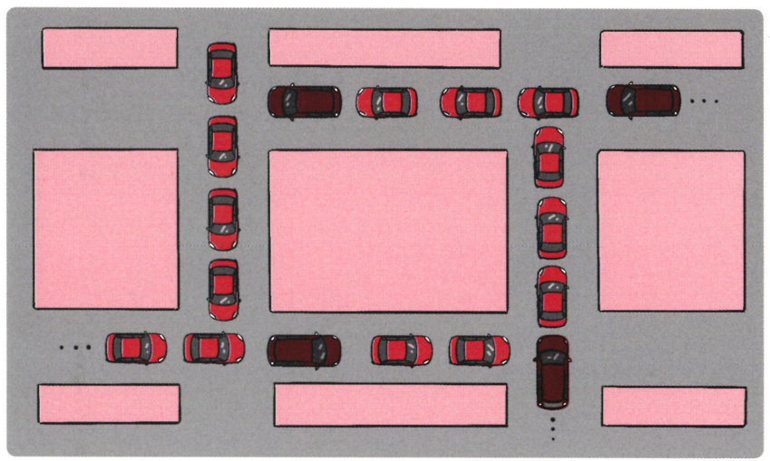

# 7장 Deadlock

# Deadlocks

- Deadlock
    - 일련의 프로세스들이 서로가 가진 자원을 기다리며 block된 상태
- Resource(자원)
    - 하드웨어, 소프트웨어 등을 포함하는 개념
    - 예) I/O device, CPU cycle, memory space, semaphore 등
    - 프로세스가 자원을 사용하는 절차
        - Request, Allocate, Use, Release
- Deadlock ex1
    - 시스템에 2개의 tape drive가 있다
    - 프로세스 P1과 P2각각 하나의 tape drive를 보유한 채 다른 하나를 기다리고 있따
- Deadlock ex2
    - Binary semaphores A and B
        
        
        

### Deadlock 발생 조건

Mutual exclusion(상호 배제)

- 한 프로세스가 자원을 독점하고 있으며 다른 프로세스들은 접근이 불가능
- 매 순간 하나의 프로세스만이 자원을 사용할 수 있음

No preemption(비선점)

- 다른 프로세스의 자원을 강제적으로 가져올 수 없음
- 프로세스는 자원을 스스로 내어놓을 뿐 강제로 빼앗기지 않음

Hold and wait(점유 대기)

- 특정 프로세스가 점유한 자원을 다른 프로세스가 요청하는 상태
- 자원을 가진 프로세스가 다른 자원을 기다릴 때 보유 자원을 놓지 않고 계속 가지고 있음

Circular wait(환형 대기)

- 프로세스 A는 프로세스 B의 자원을 요구하고, 프로세스 B는 프로세스 A의 자원을 요구하는 등 서로가 서로의 자원을 요구하는 상황
- 자원을 기다리는 프로세스 간에 사이클이 형성되어야 함

### Resource-Allocation Graph(자원할당그래프)

- Vertex
    - 프로세스 T = {T1, T2, …, Tn}
    - 자원 R = {R1, R2, …, Rm}
- Edge
    - request edge Pi → Pj
    - assignment edge Rj → Pi

- 그래프에 cycle이 없으면 deadlock이 아니다
- 그래프에 cycle이 있으면
    - if only one instance per resource type, then ***deadlock***
    - if several instances per resource type, possibility of deadlock

## Deadlock의 처리방법

- **Deadlock Prevention**
    - 자원 할당 시 Deadlock의 4가지 필요 조건 중 어느 하나가 만족되지 않도록 하는 것
- **Deadlock Avoidance**
    - 자원 요청에 대한 부가적인 정보를 이용해서 Deadlock의 가능성이 없는 경우에만 자원을 할당
    - 시스템 state가 원래 state로 돌아올 수 있는 경우에만 자원 할당
- **Deadlock Detection and recovery**
    - Deadlock 발생은 허용하되 그에 대한 detection 루틴을 두어 deadlock 발견 시 recover
- **Deadlock Ignorance**
    - Deadlock을 시스템이 책임지지 않음
    - UNIX를 포함한 대부분의 OS가 채택

### Deadlock Prevention

- Mutual Exclusion
    - 공유해서는 안되는 자원의 경우 반드시 성립해야 함
- Hold and wait
    - 프로세스가 자원을 요청할 때 다른 어떤 자원도 가지고 있지 않아야 한다
    - 방법 1. 프로세스 시작 시 모든 필요한 자원을 할당받게 하는 방법
    - 방법 2. 자원이 필요할 경우 보유 자원을 모두 놓고 다시 요청
- No Preemption
    - process가 어떤 자원을 기다려야 하는 경우 이미 보유한 자원이 선점됨
    - 모든 필요한 자원을 얻을 수 있을 때 그 프로세스는 다시 시작된다
    - State를 쉽게 save하고 restore 할 수 있는 자원에서 주로 사용(CPU, Memory)
- Circular Wait
    - 모든 자원 유형에 할당 순서를 정하여 정해진 순서대로만 자원 할당
    - 예를 들어 순서가 3인 자원 Ri를 보유중인 프로세스가 순서가 1인 자원 Rj를 할당받기 위해서는 우선 Ri를 release 해야 한다

**⇒ Utilization 저하, Throughput 감소, Starvation 문제**

### Deadlock Avoidance

- **Deadlock Avoidance**
    - 자원 요청에 대한 부가 정보를 이용해서 자원 할당이 deadlock으로부터 안전(safe)한지를 동적으로 조사해서 안전한 경우에만 할당
    - 가장 단순하고 일반적인 모델은 프로세스들이 필요로 하는 각 자원별 최대 사용량을 미리 선언하도록 하는 방법임
- **safe state**
    - 시스템 내의 프로세스들에 대한 safe sequence가 존재하는 상태
- **safe sequence**
    - 프로세스의 sequence<P1, P2, …, Pn>이 safe하려면 Pi(1 ≤ i ≤ n)의 자원 요청이 “가용자원 + 모든 Pj(j < i)의 보유자원”에 의해 충족되어야 함
    - 조건을 만족하면 다음 방법으로 모든 프로세스의 수행을 보장
        - Pi의 자원 요청이 즉시 충족될 수 없으면 모든 Pj(j < i)가 종료될 때까지 기다린다
        - P(i-1)이 종료되면 Pi의 자원요청을 만족시켜 수행한다

- 시스템이 safe state에 있으면
    
    ⇒ no deadlock
    
- 시스템이 unsafe state에 있으면
    
    ⇒ posibility of deadlock
    
- Deadlock Avoidance
    - 시스템이 unsafe state에 들어가지 않는 것을 보장
    - 2 가지 경우의 avoidance 알고리즘
        - Single instance per resource types
            - Resource Allocation Graph algorithm 사용
        - Multiple instances per resource types
            - Banker’s Algorithm 사용

### Resource Allocation Graph Algorithm

- Claim edge Pi → Rj
    - 프로세스 Pi가 자원 Rj를 미래에 요청할 수 있음을 뜻함(점선으로 표시)
    - 프로세스가 해당 자원 요청 시 request edge로 바뀜(실선)
    - Rj가 release되면 assignment edge는 다시 cliam edge로 바뀐다
- request edge의 assignment edge 변경 시 (점선을 포함하여) cycle이 생기지 않는 경우에만 요청 자원을 할당한다
- Cycle 생성 여부 조사시 프로세스의 수가 n일 때 O(n^2) 시간이 걸린다

### Examples of Banker’s Algorithm

- 5 progresses - T0, T1, T2, T3, T4
- 3 resource types - A(10), B(5), and C(7) instances - [10, 5, 7]
- Snapshot at time 0
- sequence <T1, T2, T3, T4, T0>가 존재하므로 시스템은 safe state

**이 상태에서 T1 request(1, 0, 2)**

- check that Need ≤ Available, that is, (1, 2, 2) ≤ (3, 3, 2) ⇒ True
    
    
    
- safety algorithm에 의하면 sequence <T1, T3, T4, T0, T2>는 safe
- Can request for (3, 3, 0) by T4 be granted?
- Can request for (0, 2, 0) by T0 be granted?
- ***요약하면 need보다 available이 적을 때만 자원을 제공해주고, 아닌 경우는 단 하나도 안내어줌***

### Deadlock Detection and recovery

- Deadlock Detection
    - Resource type당 single instance인 경우
        - 자원 할당 그래프에서의 cycle이 곧 deadlock을 의미
    - Reosurce type당 multiple instance인 경우
        - Banker’s algorithm과 유사한 방법 활용
- Wait-for graph 알고리즘
    - Resource type당 single instance인 경우
    - Wait-for graph
        - 자원 할당 그래프의 변형
        - 프로세스만으로 node 구성
        - Pj가 가지고 있는 자원을 Pk가 기다리는 경우 Pk → Pj
    - Algorithm
        - Wait-for graph에 사이클이 존재하는지를 주기적으로 조사
        - O(n^2)
    
    
    
    - 자원의 최대 사용량을 미리 알릴 필요 없음 → 그래프에 점선이 없음
- Resource type당 multiple instance인 경우
    - 5 processes - T0, T1, T2, T3, T4
    - 3 resource types - A(7), B(2), and C(6) instances
    - Snapshot at time T0
        
        
        
    - No deadlock : sequence <T0, T2, T3, T1, T4> will work!
- Recovery
    - Process termination
        - Abort all deadlocked processes
        - Abort one process at a time until the deadlock cycle is eliminated
    - Resource Preemption
        - 비용을 최소화할 victim 선정
        - safe state로 rollback하여 process를 restart
        - Starvation 문제
            - 동일한 프로세스가 계속해서 victim으로 선정되는 경우
            - cost factor에 rollback 횟수도 같이 고려