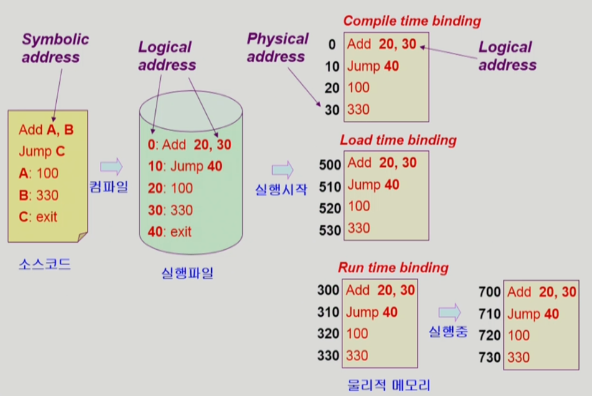

# 8장 Memory Management

### Logical Address *VS* Physical Address

- Logical address(=virtual address)
    - 프로세스마다 독립적으로 가지는 주소 공간
    - 각 프로세스마다 0번지부터 시작
    - **CPU가 보는 주소는 *logical address*임**
- Physical address
    - 메모리에 실제로 올라가는 위치
- 주소 바인딩 : 주소를 결정하는 것
    - Symbolic Address → Logical Address → (주소 바인딩이 되는 이 시점이 언제인가?) → Physical Address

### 주소 바인딩(Address Binding)

- Compile time binding
    - 물리적 메모리 주소(Physical Address)가 컴파일 시 알려짐
    - 시작 위치 변경 시 재컴파일
    - 컴파일러는 절대 코드(absolute code) 생성
- Load time binding
    - Loader의 책임하에 물리적 메모리 주소 부여
    - 컴파일러가 재배치가능코드(relocate code)를 생성한 경우 가능
- Execution time binding(=Run time binding)
    - 수행이 시작된 이후에도 프로세스의 메모리 상 위치를 옮길 수 있음
    - CPU가 주소를 참조할 때마다 binding을 점검(address mapping table)
    - 하드웨어적인 지원 필요
        - e.g., base and limit registers, MMU



설명 : A값과 B값을 더한 뒤, A에 저장하고 C로 건너 뛰는 코드를 만든 상태 → 컴파일 시 실행파일과 같이 Logical Address가 할당됨 → 실행 시작 시 3가지 경우가 있음. 1. Compile time binding의 경우 컴파일했을 때와 동일한 주소공간을 Physical Address로 사용하기 때문에 CPU에서 한 프로그램만 실행할 때나 가능하고, 현재로서는 매우 비효율적, 메모리에 올라간 주소를 바꾸고 싶으면 컴파일을 다시해야함 2. Load time binding의 경우 500번지부터 비어있다고 가정하면 해당 위치에 주소 공간을 할당함.(0번지를 500번지부터 할당함), 3. Run time binding의 경우 실행 시에 결정되는 것은 같지만, 실행도중 바뀔 수 있음. 논리주소 0번지가 300번지에 있다고 가정, 실행되다가 700번지로 이동할 수 있다는 말임.(메모리에서 쫓겨나거나 하는 등, 700번지부터 올리는 뜻), 현재로서는 Run time binding 많이 사용. Run time binding의 경우 그때그때 주소변환을 새로 해야하기 때문에 하드웨어적 지원이 필요하다(MMU)

### Memory Management Unit(MMU)

- MMU(Memory Management Unit)
    - **Logical Address**를 **Physical Address**로 매핑해주는 하드웨어 장치
- MMU Scheme
    - 정의 : MMU가 사용하는 주소 변환 방식이나 메모리 관리 정책
    - 일반적으로 사용자 프로세스가 CPU에서 수행되며 생성해내는 모든 주소값에 대해 **base register(=relocation register)**의 값을 더한다
- user problem
    - 사용자 레벨의 프로세스가 MMU의 동작에 의해 발생하는 문제를 가리킴
    - **logical address**만을 다룬다
    - 실제 **physical address**를 볼 수 없으며 알 필요가 없다

### Dynamic Relocation


설명 : CPU가 346번지에 있는 값을 달라(logical) → 주소변환(MMU) → 가장 간단한 주소변환 : relocation register(=base register), Limit Register() 두 개를 통해 주소 변환함. → p1이 CPU에서 실행 중이고, 이 프로세스의 Logical Address를 나타냄, CPU에서는 346번지 값을 요청한 상황. 이 때 physical Address에 저장된 14000에서 346만큼 더한 값인 14346 값을 반환해줌 → MMU Scheme에서는 base register에 해당 프로그램의 시작위치를 저장해둠., Limit Register는 해당 프로그램의 크기를 담고 있음. 이를 통해 메모리 악용을 방지

### Hardware Support for Address Translation


운영체제 및 사용자 프로세스 간의 메모리 보호를 위해 사용하는 레지스터

- Relocation Resiger(=Base Register) : 접근할 수 있는 물리적 메모리 주소의 최솟값
- Limit Register : 논리적 주소의 범위

## Some Terminologies

### Dynamic Loading

- 직역하면 ‘메모리에 동적으로 올린다’는 뜻
- 프로세스 전체를 메모리에 미리 다 올리는 것이 아니라 해당 루틴이 불려질 때 메모리에 load하는 것
- memory utilization 향상
- 가끔 사용되는 많은 양의 코드의 경우 유용
    - 예) 오류 처리 루틴
- 운영체제의 특별한 지원 없이 프로그램 자체에서 구현 가능(OS는 라이브러리를 통해 지원 가능)

```markdown
Loading : 메모리로 올리는 것
```

- 프로그래머가 dynamic loading을 명시적으로 해서 이뤄지는것이 원래 dynamic loading이지만 명시하지 않고 운영체제(CPU)가 알아서 하는것도 dynamic loading에 속한다고 함

### Overlays

- Dynamic Loading과 비슷함, 역사적으로 다름. 옛날에는 프로세스의 크기가 메모리보다 컸고, 이 때 프로세스를 쪼개고 알고리즘적으로 구현했었음
- 메모리에 프로세스의 부분 중 실제 필요한 정보만을 올림
- 프로세스의 크기가 메모리보다 클 때 유용
- 운영체제의 지원없이 사용자에 의해 구현
- 작은 공간의 메모리를 사용하던 초창기 시스템에서 수작업으로 프로그래머가 구현
    - Manual Overlay
    - 프로그래밍이 매우 복잡

### Swapping

- Swapping
    - 프로세스를 일시적으로 메모리에서 backing store로 쫓아내는 것
- Backing store(=swap area)
    - 디스크
        - 많은 사용자의 프로세스 이미지를 담을 만큼 충분히 빠르고 큰 저장 공간
- Swap in / Swap out
    - 일반적으로 중기 스케줄러(=swapper)에 의해 swap out 시킬 프로세스 선정
    - Priority - based CPU Scheduling Algorithm
        - Priority가 낮은 프로세스를 swapped out 시킴
        - Priority가 높은 프로세스를 메모리에 올려놓음
    - Compile time 혹은 load time binding에서는 원래 메모리 위치로 swap in 해야함
    - Execution time binding에서는 추후 빈 메모리 영역 아무데나 올릴 수 있음
    - 데이터 양이 대부분 방대하기 때문에 swap time은 대부분 transfer time(swap되는 양에 비례하는 시간)임
- Schematic View of Swapping
    
    
    
- Run time binding이 지원되어야 효율적인 사용이 가능함

### Dynamic Linking

- Linking을 실행 시간(execution time)까지 미루는 기법
- Static linking
    - 라이브러리가 프로그램의 실행 파일 코드에 포함됨
    - 실행 파일의 크기가 커짐
    - 동일한 라이브러리를 각각의 프로세스가 메모리에 올리므로 **메모리 낭비**
        - (eg. printf 함수의 라이브러리 코드)
    - 장점
        1. 실행 파일 자체가 독립적이며 이식성이 높아짐
        2. 실행 속도가 빠름
        3. 버전 충돌 문제가 발생하지 않음
    - 단점
        1. 디스크 공간을 더 많이 차지
        2. 각각의 응용 프로그램이 라이브러리의 복사본을 가지게 되어 메모리 사용량이 증가
        3. 라이브러리 업데이트 시, 응용 프로그램 전체를 다시 빌드할 필요 있음
- Dynamic linking(=Shared Library)
    - 해당 라이브러리에 접근 시 연결(link)됨
    - 라이브러리 호출 부분에 라이브러리 루틴의 위치를 찾기 위한 stub(소위 포인터)이라는 작은 코드를 둠
    - 라이브러리가 이미 메모리에 있으면 그 루틴의 주소로 가고 없으면 디스크에서 읽어옴
    - 운영체제의 도움이 필요
    - 장점
        1. 실행 파일의 크기가 작아지며 디스크 공간을 절약
        2. 여러 응용 프로그램이 같은 라이브러리를 공유할 수 있으므로 메모리 사용량이 감소
        3. 라이브러리가 업데이트되어도 응용 프로그램을 다시 빌드할 필요가 없음
    - 단점
        1. 실행 시간에 라이브러리 로딩과 링크 과정이 추가됨
        2. 응용 프로그램과 라이브러리 간의 버전 충돌 문제가 발생할 수 있음
- 사용 용도
    - 정적 링킹
        - 응용 프로그램을 완전히 독립적으로 배포하고자 할 때 유용
        - 이식성과 실행 속도가 중요한 경우에 사용됨
        - 라이브러리의 버전 관리와 충돌 문제를 피하고자 할 때도 정적 링킹을 선택할 수 있슴
    - 동적 링킹
        - 여러 응용 프로그램이 동일한 라이브러리를 공유하거나 라이브러리의 업데이트와 관리를 용이하게 하기 위해 사용됨.
        - 메모리 사용량을 줄이고, 라이브러리의 관리 및 버전 업데이트를 효율적으로 수행가능
    - 정리
        - 정적 링킹(Static linking)은 응용 프로그램의 크기가 작고 이식성과 실행 속도가 중요한 경우에 유용
        - 동적 링킹(Dynamic Linking)은 라이브러리의 공유와 관리가 필요한 경우에 적합

---

`이제 물리적인 메모리를 어떻게 관리할 것인가?`

# Allocation of Physical Memory

- 메모리는 일반적으로 두 영역으로 나눠서 사용
    
    
    
    - OS 상주 영역
        - interrupt vector와 함께 낮은 주소 영역 사용
    - 사용자 프로세스 영역
        - 높은 주소 영역 사용
- 사용자 프로세스 영역의 할당 방법
    - Continuous allocation(연속 할당)
        - 각각의 프로세스가 메모리의 연속적인 공간에 **통채로** 적재되도록 하는 것
        - Fixed partition allocation
        - Variable partition allocation
    - Noncontiguous allocation(불연속 할당)
        - 하나의 프로세스가 메모리의 여러 영역에 **분산되어** 올라갈 수 있음
        - Paging
        - Segmentation
        - Paged Segmentation

## Continuous allocation(연속 할당)


```markdown
External fragmentation(외부조각)
- 프로그램 크기보다 분할의 크기가 작은 경우
- 아무 프로그램에도 배정되지 않은 빈 곳인데도 프로그램이 올라갈 수 없는 작은 분할

Internal fragmentation(내부조각)
- 프로그램 크기보다 분할의 크기가 큰 경우
- 하나의 분할 내부에서 발생하는 사용되지 않는 메모리 조각
- 특정 프로그램에 배정되었지만 사용되지 않는 공간
```

### Fixed partition allocation(고정 분할 방식)

- **프로그램이 들어갈 사용자 메모리 공간을 미리 나눠둠**
- 물리적 메모리를 몇개의 영구적 분할(partition)으로 나눔
- 분할의 크기가 모두 동일한 방식과 서로 다른 방식이 존재
- 분할당 하나의 프로그램 적재
- 융통성이 없음
    - 동시에 메모리에 load 되는 프로그램의 수가 고정됨
    - 최대 수행 가능 프로그램 크기 제한
- Internal fragmentation 발생(external fragmentation도 발생)

### Variable partition allocation(가변 분할 방식)

- **프로그램이 들어갈 사용자 메모리 공간을 미리 나누지 않음**
- 프로그램의 크기를 고려해서 할당
- 분할의 크기, 갯수가 동적으로 변함
- 기술적 관리 기법 필요
- External fragmentation 발생

### **Hole**


- 가용 메모리 공간
- 다양한 크기의 hole들이 메모리 여러곳에 흩어져 있음
- 프로세스가 도착하면 수용가능한 hole을 할당
- 운영체제는 다음의 정보를 유지
    - 할당 공간
    - 가용 공간(hole)

`hole이 여러군데 있을텐데 어느 hole에 넣을건가?`

### **Dynamic Storage-Allocation Problem**

가변 분할 방식에서 size n인 요청을 만족하는 가장 적절한 hole을 찾는 문제

- First-fit
    - Size가 n 이상인 것 중 최초로 찾아지는 hole에 할당
- Best-fit
    - Size가 n 이상인 가장 작은 hole을 찾아 할당
    - Hole들의 리스트가 크기순으로 정렬되지 않은 경우 모든 hole의 리스트를 탐색해야 함
    - 많은 수의 아주 작은 hole들이 생성됨
- Worst-fit
    - 가장 큰 hole에 할당
    - 역시 모든 리스트를 탐색해야 함
    - 상대적으로 아주 큰 hole들이 생성됨
- First-fit과 Best-fit이 Worst-fit보다 속도와 공간 이용률 측면에서 효과적인 것으로 알려짐

### Compaction

- external fragmentation 문제를 해결하는 한 가지 방법
- **사용 중인 메모리 영역을 한 군데로 몰고 hole들을 다른 한 곳으로 몰아 큰 block을 만드는 것**
- 매우 비용이 많이 드는 방법임
- 최소한의 메모리 이동으로 compaction하는 방법(매우 복잡)
- Compaction은 프로세스의 주소가 실행 시간에 동적으로 재배치 가능한 경우에만 수행될 수 있다

## Noncontiguous allocation(불연속 할당)

### Paging

**프로그램을 구성하는 주소공간을 같은 크기의 페이지로 자름**, 주소 변환을 페이지별로 해야해서 복잡해짐


- Process의 virtual memory를 동일한 사이즈의 page로 나눔
- Virtual memory의 내용이 page 단위로 noncontiguous하게 저장됨
- 일부는 backing storage에, 일부는 physical memory에 저장
- **Basic Method**
    - physical memory를 동일한 크기의 frame으로 나눔
    - logical memory를 동일 크기의 page로 나눔(frame과 같은 크기)
    - 모든 가용 frame들을 관리
    - page table을 사용하여 logical address를 physical address로 변환
    - External fragmentation(외부 조각) 발생 안함
    - Internal fragmentation(내부 조각) 발생 가능

### Address Translation Architecture


### Implementation of Page Table

- Page table은 main memory에 상주
- Page-table base register(PTBR)가 page table을 가리킴
- Page-table length register(PTLR)가 테이블 크기를 보관
- 모든 메모리 접근 연산에는 2번의 memory access 필요
- page table 접근 1번, 실제 data / instruction 접근 1번
- 속도 향상을 위해
    - associative register 혹은 translation look-aside buffer(TLB)라 불리는 고속의 lookup hardware cache 사용

### Paging Hardware with TLB


페이지 테이블은 모든 논리 주소에 대한 물리 주소공간을 저장하고 있기 때문에 p번째에 f가 있다는게 확실함. 근데 TLB에서는 p번째에 f가 있는게 아니기 때문에 p와 f를 둘 다 저장해야함. 또한, TLB를 다 검색해봐야 함. 없으면 page table로 가서 찾음.

`TLB에서 검색할 때 다 찾아봐야 하는데 그 찾는 시간을 줄여야 함`

### Associative Register

- Associative Registers(TLB) : parallel search가 가능
    - TLB에는 page table 중 일부만 존재
- Address translation
    - page table 중 일부가 associative register에 보관되어 있음
    - 만약 해당 page # 가 associative register에 있는 경우 곧바로 frame #을 얻음(TLB hit)
    - 그렇지 않은 경우(TLB miss) main memory에 있는 page table로부터 frame #을 얻음
    - TLB는 context switch 때 flush(remove old entries)

### Effective Access Time

- Associative register lookup time = ε
- memory cycle time = 1
- Hit ratio = α (associative register에서 찾아지는 비율)
- Effective Access Time(EAT)
    
    EAT = (1 + ε)α`hit` + (2 + ε)(1 - α)`miss` = 2 + ε - α
    

### Two-Level Page Table


- 현대의 컴퓨터는 addess space가 매우 큰 프로그램 지원
    - 32 bit address 사용시 : 2³²(4G)의 주소공간
        - page size가 4K시 1M개의 page table entry 필요
        - 각 page entry가 4B시 프로세스당 4M의 page table 필요
        - 그러나, 대부분의 프로그램은 4G의 주소공간 중 지극히 일부분만 사용하므로 page table 공간이 심하게 낭비됨
    - page table 자체를 page로 구성
    - **사용되지 않는 주소 공간에 대한 outer page table의 엔트리 값은 NULL(대응하는 inner page table이 없음)**

### Two-Level Paging Example

- local address(on **32**-bit machine with 4K page size)의 구성
    - 20 bit의 page number
    - 12 bit의 page offset
- page table 자체가 page로 구성되기 때문에 page number는 다음과 같이 나뉜다(각 page table entry가 4B)
    - 10 bit의 page number
    - 10 bit의 page offset
- 따라서 logical address는 다음과 같다
    
    
    
- *p₁*은 outer page table의 index이고
- *p₂*는 outer page table의 page에서의 변위(displacement)
- 2단계 페이징에서의 Address-translation scheme
    
    
    

### Multilevel Paging and Performance

- Address space가 더 커지면 다단계 페이지 테이블 필요
- 각 단계의 페이지 테이블이 메모리에 존재하므로 logical address의 physical address 변환에 더 많은 메모리 접근 필요
- TLB를 통해 메모리 접근 시간을 줄일 수 있음
- 4단계 페이지 테이블을 사용하는 경우
    - 메모리 접근 시간이 100ns, TLB 접근 시간이 20ns이고
    - TLB hit ratio가 98%인 경우
        
        effective memory access time = 0.98 X 120 + 0.02 X 520 = 128 ns
        
        결과적으로 주소변환을 위해 28ns만 소요
        

### Segmentation

프로그램의 주소공간을 같은 크기가 아닌 의미가 있는 크기로 자름. 주소 공간이라는게 code, data, stack이 있는데, 이를 기준으로 크게 자르고 각각의 세그먼트를 필요시 물리적인 메모리의 다른 위치에 올리는 기법

더 작게 자를 수도 있고 여러 기준이 존재함(segment(의미)를 기준으로 잘랐기 때문에 크기또한 균일하지 않음)