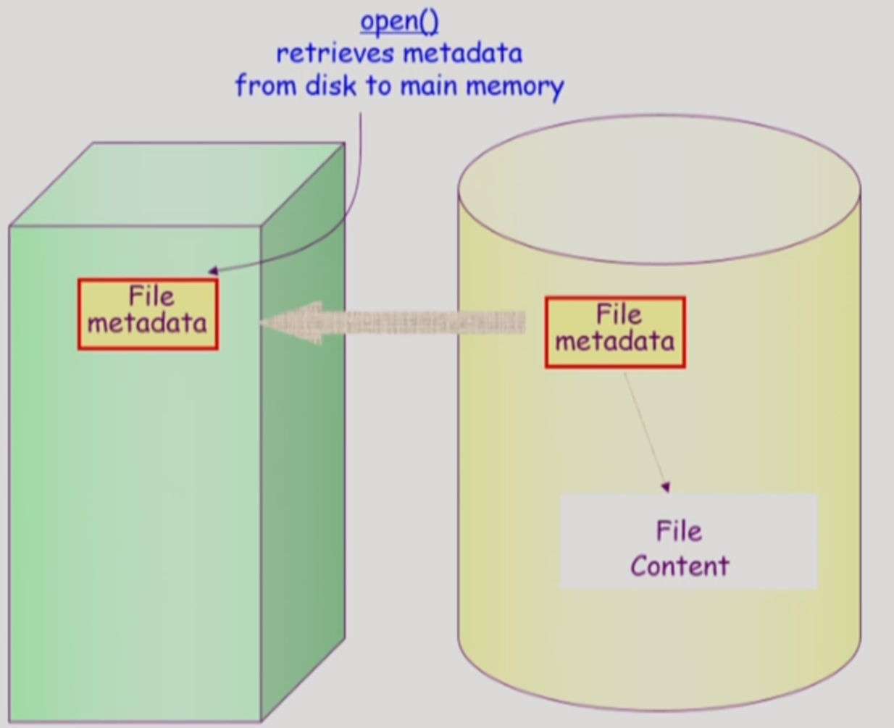
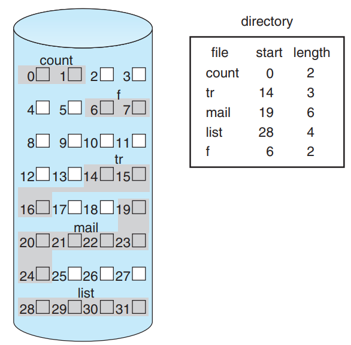

# 10장 File Systems

### File and File System

**File**

- “A named collection of related information”
- 일반적으로 비휘발성의 보조기억장치에 저장
- 운영체제는 다양한 저장 장치를 file이라는 동일한 논리적 단위로 볼 수 있게 해줌
- Operation(연산)
    - create, read, write, reposition(lseek), delete, open, close 등
    - open : 파일의 metadata를 올려놓는 연산

**File Attribute**(혹은 파일의 **metadata**)

- 파일 자체의 내용이 아니라 파일을 관리하기 위한 각종 정보들
    - 파일 이름, 유형, 저장된 위치, 파일 사이즈
    - 접근 권한(읽기/쓰기/실행), 시간(생성/변경/사용), 소유자 등

**File System**

- 운영체제에서 파일을 관리하는 부분
- 파일 및 파일의 메타데이터, 디렉토리 정보 등을 관리
- 파일의 저장 방법 결정
- 파일 보호 등

### Directory and Logical Disk

**Directory**

- 파일의 메타데이터 중 일부를 보관하고 있는 일종의 특별한 파일
- 그 디렉토리에 속한 파일 이름 및 파일 attribute들
- operation
    - search for a file, create a file, delete a file
    - list a directory, rename a file, traverse the file system

**Partition(=Logical Disk)**

- 하나의 (물리적) 디스크 안에 여러 파티션을 두는게 일반적
- 여러 개의 물리적인 디스크를 하나의 파티션으로 구성하기도 함
- (물리적) 디스크를 파티션으로 구성한 뒤 각각의 파티션에 file system을 깔거나 swapping 등 다른 용도로 사용할 수 있음

### open()

- 파일의 메타데이터(파일 이름, 유형, 저장된 위치, 파일 사이즈 등)를 메모리로 올려놓는 것
    
    
    
- open(”/a/b/c”)
    - 디스크로부터 파일 c의 메타데이터를 메모리로 가지고 옴
    - 이를 위해 directory path를 search
        - 루트 디렉토리 “/”를 open하고 그 안에서 파일 “a”의 위치 획득
        - 파일 “a”를 open한 후 read하여 그 안에서 파일 “b”의 위치 획득
        - 파일 “b”를 open한 후 read하여 그 안에서 파일 “c”의 위치 획득
        - 파일 “c”를 open한다
    - Direcory path의 search에 너무 많은 시간 소요
        - Open을 read / write와 별도로 두는 이유
        - 한번 open한 파일은 read / write시 directory search 불필요
    - Open file table
        - 현재 open된 파일들의 메타데이터 보관소(in memory)
        - 디스크의 메타데이터보다 몇 가지 정보가 추가
            - Open한 프로세스의 수
            - File offset : 파일 어느 위치 접근 중인지 표시(별도 테이블 필요)
    - File descriptor(file handle, file control block)
        - Open file table에 대한 위치 정보(프로세스 별)
    
    
    

### File Protection

- 각 파일에 대해 누구에게 어떤 유형의 접근(read/write/execution)을 허락할 것인가?
- Access Control방법
    - **Access control Matrix**
        
        
        
        - **Access Control List** : 파일별로 누구에게 어떤 접근 권한이 있는지 표시
        - **Capability** : 사용자별로 자신이 접근권한을 가진 파일 및 해당 권한 표시
    - **Grouping**
        - 전체 user를 owner, group, public의 세 그룹으로 구분
        - 각 파일에 대해 세 그룹의 접근 권한(rwx)을 3비트씩으로 표시
        - 예) UNIX
            
            
            
    - **Password**
        - 파일마다 password를 두는 방법(디렉토리 파일에 두는 방법도 가능)
        - 모든 접근 권한에 대해 하나의 password : all-or-nothing
        - 접근 권한별 password : 암기문제, 관리 문제

### File System의 Mounting

### Access Methods

시스템이 제공하는 파일 정보의 접근 방식

- 순차 접근(sequential access)
    - 카세트 테이프를 사용하는 방식처럼 접근
    - 읽거나 쓰면 offset은 자동적으로 증가
- 직접 접근(direct access, random access)
    - LP 레코드 판과 같이 접근하도록 함
    - 파일을 구성하는 레코드를 임의의 순서로 접근할 수 있음
---
---
# 11장 File System Implementation

## Allocation of File Data in Disk

### Contiguous Allocation

**장점**

- Fast I/O
    - 한 번의 seek/rotation으로 많은 바이트 transfer
    - Realtime file 용으로, 또는 이미 run 중이던 process의 swapping용
- Direct access(=random access)가능

**단점**

- External fragmentation(외부조각)
- File grow가 어려움(=크기를 키우기 어렵다)
    - file 생성시 얼마나 큰 hole을 배당할 것인가?
    - grow 가능 *vs* 낭비(Internal fragmentation)

`공간 효율성 < 속도 효율성`

### Linked Allocation

장점

- External fragmentation 발생 안함

단점

- No random access
- Reliability 문제
    - 한 sector가 고장나 pointer가 유실되면 많은 부분을 잃음
- Pointer를 위한 공간이 block의 일부가 되어 공간 효율성을 떨어뜨림
    - 512 bytes/sector, 4 bytes/pointer

변형

- *File-allocation table(FAT)*파일 시스템
    - 포인터를 별도의 위치에 보관하여 reliability와 공간효율성 문제 해결

### Indexed Allocation

장점

- External fragmentation이 발생하지 않음
- Direct access 가능

단점

- Small file의 경우 공간 낭비(실제로 많은 file들이 small)
- Too Large file의 경우 하나의 block으로 index를 저장하기에 부족
    - 해결 방안
        1. linked scheme
        2. multi-level index

### UNIX 파일 시스템의 구조

UNIX 파일 시스템(Partition(=Logical Disk))은 크게 네 가지로 구성

- Boot block
    - 부팅에 필요한 정보(bootstrap loader)
- Super block
    - 파일 시스템에 관한 총체적인 정보 보관
- Inode list
    - 파일 이름을 제외한 파일의 모든 메타데이터를 저장
    
    
    
    - file metadata에는 다음과 같은 것들이 있음
        - mode, owners(2), timestamps(3), size block, count
- Data block
    - 파일의 실제 내용을 보관
    - directory file
        
        
        

### FAT File System

- `FAT의 크기는 Data block에서 관리하는 파일의 갯수만큼 할당된다`
- Indexed allocation과 달리 실제 Data block에 접근하는 것이 아닌 FAT만 확인해보면 되기 때문에 Direct access가 가능함
- 보통은 FAT을 2개 이상 copy 해 둠

### Free-Space Management

- Bit map or bit vector
    
    
    
    - Bit map은 부가적인 공간을 필요로 함
    - 연속적인 n개의 free block을 찾는데 효과적
- Linked list
    - 모든 free block들을 링크로 연결(free list)
    - 연속적인 가용공간을 찾는 것은 쉽지 않음
    - 공간의 낭비가 없음
    
    
    
- Grouping
    - linked list 방법의 변형
    - 첫 번째 free block이 n개의 pointer를 가짐
        - n-1 pointer는 free data block을 가리킴
        - 마지막 pointer가 가리키는 block은 또 다시 n pointer를 가짐
- Counting
    - 프로그램들이 종종 여러개의 연속적인 block을 할당하고 반납한다는 성질에 착안
    - (first free block, # of contiguous free block)을 유지

### Directory Implementation

- Linear list
    - <file name, file의 metadata>의 list
    - 구현이 간단
    - 디렉토리 내에 파일이 있는지 찾기 위해서는 linear search 필요(time consuming)
- Hash Table
    - linear list + hashing
    - Hash table은 file name을 이 파일의 linear list의 위치로 바꿔줌
    - search time을 없앰
    - Collision 발생 가능

- File의 metadata의 보관 위치
    - 디렉토리 내에 직접 보관
    - 디렉토리에는 포인터를 두고 다른 곳에 보관
        - inode, FAT 등
- Long file name의 지원
    - <file name, file의 metadata>의 list에서 각 entry는 일반적으로 고정 크기
    - file name이 고정 크기의 entry 길이보다 길어지는 경우 entry의 마지막 부분에 이름의 뒷부분이 위치한 곳의 포인터를 두는 방법
    - 이름의 나머지 부분은 동일한 directory file의 일부에 존재

### VFS and NFS

- Virtual File System(VFS)
    - 서로 다른 다양한 file system에 대해 동일한 시스템 콜 인터페이스(API)를 통해 접근할 수 있게 해주는 OS의 layer
- Network File System(NFS)
    - 분산 시스템에서는 네트워크를 통해 파일이 공유될 수 있음
    - NFS는 분산 환경에서의 대표적인 파일 공유 방법임

## Page Cache and Buffer Cache

### **Page Cache**

- Virtual memory의 paging system에서 사용하는 page frame을 caching의 관점에서 설명하는 용어
- Memory-Mapped I/O를 쓰는 경우 file의 I/O에서도 page cache 사용

### **Memory-Mapped I/O**

- File의 일부를 virtual memory에 mapping 시킴
- 매핑시킨 영역에 대한 메모리 접근 연산은 파일의 입출력을 수행하게 함

### **Buffer Cache**

- 파일시스템을 통한 I/O 연산은 메모리의 특정 영역인 buffer cache 사용
- File 사용의 locality 활용
    - 한번 읽어온 block에 대한 후속 요청시 buffer cache에서 즉시 전달
- 모든 프로세스가 공용으로 사용
- Replacement algorithm 필요(LRU, LFU 등)

### **Unified Buffer Cache**

- 최근의 OS에서는 기존의 buffer cache가 page cache에 통합됨
- `필요에 따라서 page cache에 할당해서 사용`
- 구분이 되어 있었던 과거 시스템들과 달리 현재 리눅스와 같은 OS에서는 구분없이 필요 시 그때그때 바로 가져와서 용도에 맞게 사용한다
    - 이럴려면 buffer cache랑 page cache의 크기가 같아야 하는데, 요즘엔 4kB로 통일해서 가능

---

---

